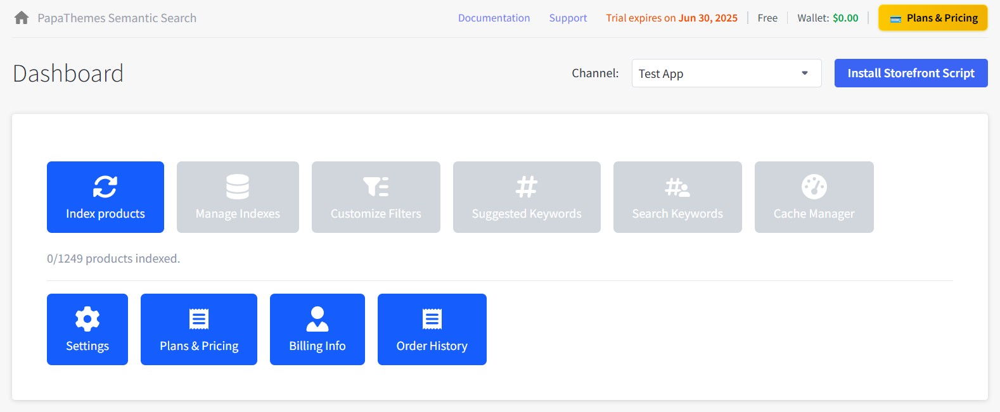
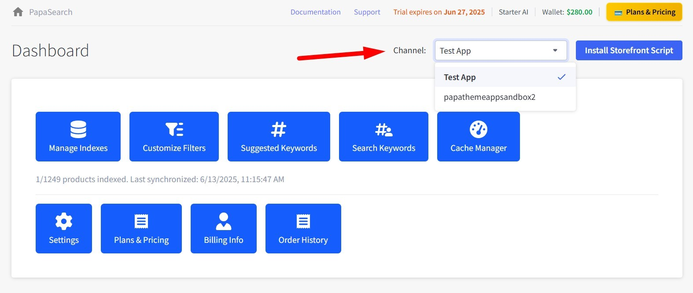
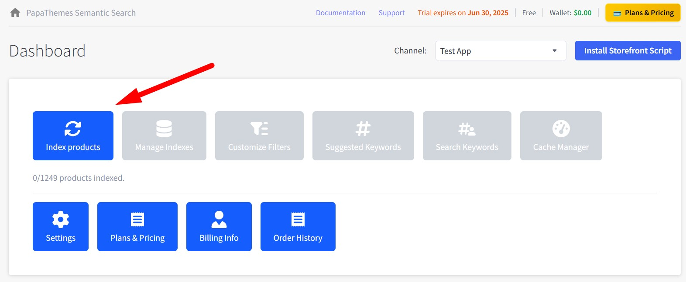
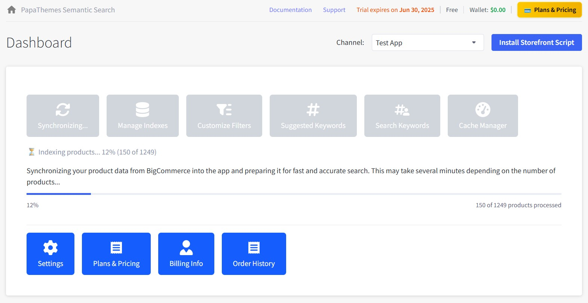
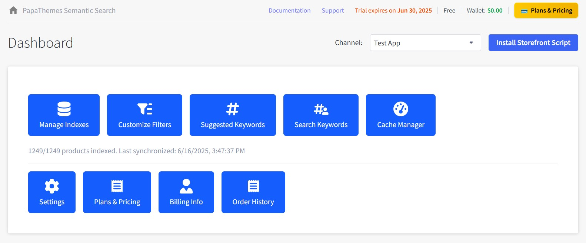
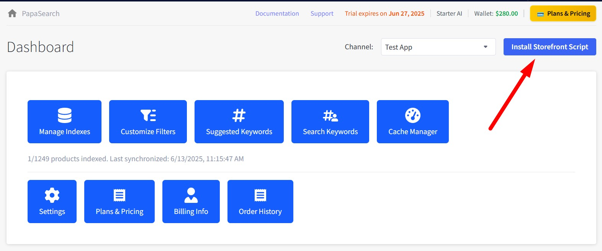
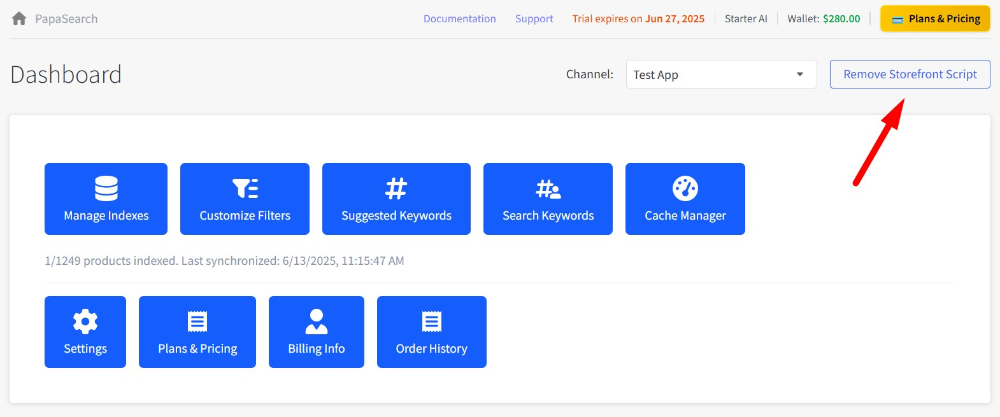
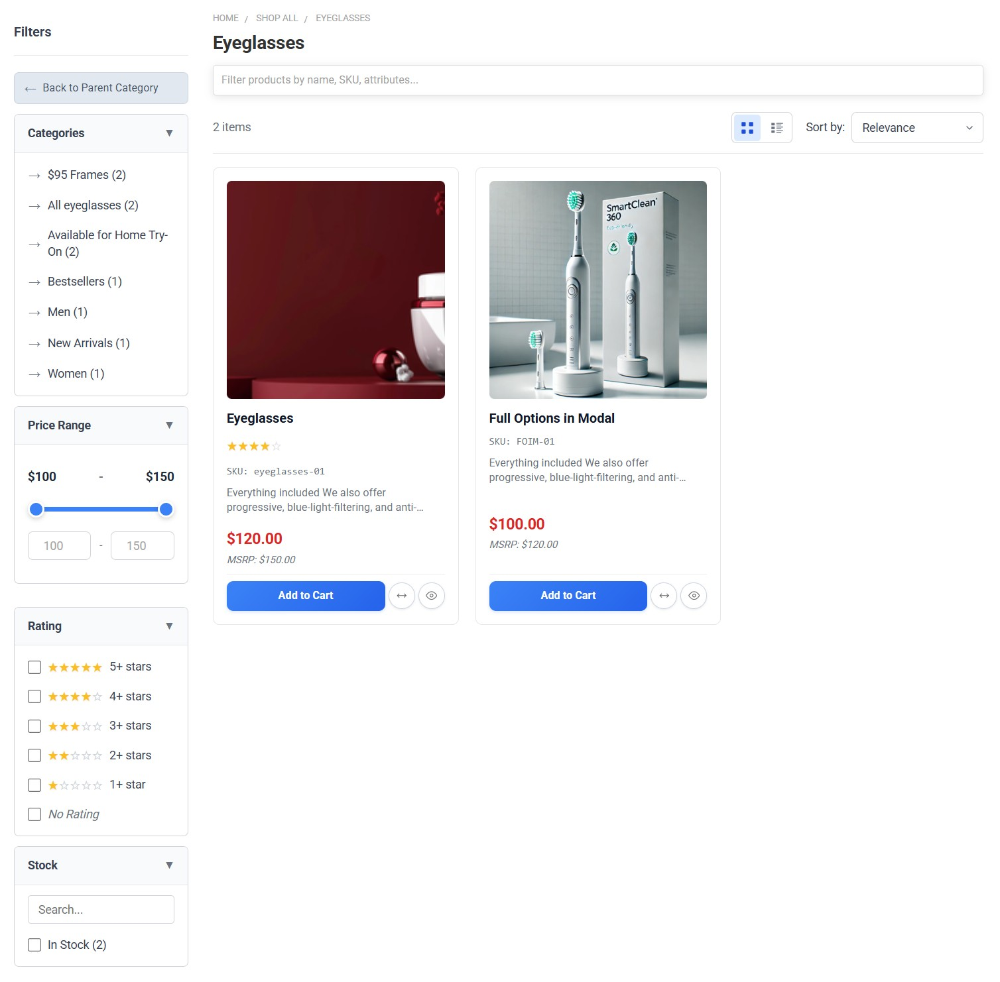
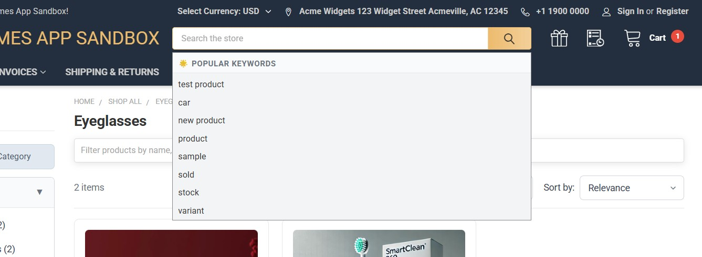

# Chapter 1: App Installation & Setup

This chapter will guide you through installing the PapaSearch - Search & Filter App for BigCommerce and getting it properly configured on your store.

## Prerequisites

Before you begin, make sure you have:

- **Store admin access** to your BigCommerce store
- **Store owner or staff** permissions
- An **active BigCommerce subscription** (Starter, Standard, Plus, Pro, or Enterprise)

---

## Step 1: Installing the App from BigCommerce Marketplace

### 1.1 Access the BigCommerce App Marketplace

1. **Log into your BigCommerce store admin panel**
   - Go to your store's admin URL (usually: `https://store-[your-hash].mybigcommerce.com/manage`)
   - Enter your username and password

   `[SCREENSHOT: BigCommerce login page with username and password fields highlighted]`

2. **Navigate to the Apps section**
   - In the left sidebar menu, click on **"Apps"**
   - Click on **"Marketplace"** from the dropdown menu

   `[SCREENSHOT: BigCommerce admin sidebar showing Apps menu expanded with Marketplace option highlighted]`

### 1.2 Find and Install the App

1. **Search for the app**
   - In the Marketplace search bar, type **"Semantic Search"** or **"PapaSearch"**
   - Press Enter or click the search button

   `[SCREENSHOT: App Marketplace search bar with "Semantic Search" typed in]`

2. **Locate the app**
   - Look for **"PapaSearch - Search & Filter App for BigCommerce"** in the search results
   - The app should show the PapaThemes logo and description

   `[SCREENSHOT: Search results showing the Semantic Search app with logo and description visible]`

3. **Review app details**
   - Click on the app to view its details page
   - Review the features, pricing, and requirements
   - Check compatibility with your store plan

   `[SCREENSHOT: App details page showing features, pricing, screenshots, and install button]`

4. **Install the app**
   - Click the **"Install"** button (usually blue)
   - A permissions dialog will appear

   `[SCREENSHOT: App permissions dialog showing what access the app requires]`

5. **Accept permissions**
   - Review the permissions the app needs (these are standard for search apps)
   - Click **"Confirm"** or **"Accept & Install"**
   - Wait for the installation to complete (usually 10-30 seconds)

   `[SCREENSHOT: Installation progress screen or success message]`

### 1.3 Access the Installed App

1. **Find the app in your Apps list**
   - Go to **Apps → My Apps** in your BigCommerce admin
   - Look for the Semantic Search app in your installed apps list

   `[SCREENSHOT: My Apps page showing the installed Semantic Search app]`

2. **Launch the app**
   - Click **"Launch"** next to the app name
   - The app will open in a new tab or iframe within BigCommerce

   `[SCREENSHOT: App launch button highlighted]`

---

## Step 2: Initial App Setup and Configuration

### 2.1 First Time Launch

When you first launch the app, you'll see the **Dashboard** with several setup options.

### 2.2 Channel Selection

1. **Select your storefront channel**
   - If you have multiple channels, select the one you want to enable search for
   - Most stores only have one channel (your main storefront)
   - Click the dropdown to see available channels

2. **Confirm channel selection**
   - Choose your primary sales channel
   - Click **"Select"** or **"Confirm"**

---

## Step 3: Initial Product Indexing

This step is important - you need to index your products before installing the script so that filters will work properly.

### 3.1 Start Product Indexing

**1. Click Index Products button**

On the Dashboard, look for and click the **"Index products"** button:

**2. Wait for indexing to complete**

After clicking the button, the indexing process will start automatically:

- You'll see a progress indicator showing indexing status
- Depending on your catalog size, this may take 5-30 minutes
- Wait until the process is completely finished

### 3.2 Indexing Complete

When finished, you'll see the number of indexed products and timestamp below the button. Additional features like Index Management, Customize Filters, Suggest Keywords, and Cache Management will also be unlocked.

---

## Step 4: Install the Frontend Script

Now that your products are indexed, you can install the script that powers the search functionality on your actual storefront.

### 4.1 Understanding the Script

The frontend script enables:

- Enhanced search functionality in your theme
- Product filtering capabilities
- Real-time search suggestions
- Improved search results display

### 4.2 Automatic Script Installation

**Locate the Install Script button**

On the Dashboard, look for a button labeled **"Install Storefront Script"**

**Click Install Storefront Script**

   - Click the **"Install Storefront Script"** button
   - Wait a few seconds for the installation to complete
   - The button will automatically change to **"Remove Storefront Script"**
   - A popup notification will appear confirming the script has been installed successfully

---

## Step 5: Verify Installation

### 5.1 Check Script Status

**Verify script installation in the app**

After successful installation, you can verify the script status:

- The **"Install Storefront Script"** button has changed to **"Remove Storefront Script"**
- This confirms the script has been successfully installed on your storefront
- The script is now active and enhancing your store's search functionality

### 5.2 Test on Your Storefront

**1. Visit your store**

  - Open your storefront in a new browser tab
  - Go to any product category page

**2. Test search functionality**

   - Use the search bar to search for a product
   - You should see enhanced search results
   - Look for improved filtering options

**3. Test filters**

   - On a category page, look for filter options in the sidebar
   - Try selecting different filters
   - Products should update automatically

---

## Troubleshooting Installation Issues

### App Installation Problems

**Problem**: Cannot find the app in BigCommerce Marketplace

- **Solution**: Search for "PapaSearch" or "PapaThemes"
- **Solution**: Contact support for direct installation link

**Problem**: App fails to launch after installation

- **Solution**: Refresh your browser and try again
- **Solution**: Clear browser cache and cookies
- **Contact Support**: If the issue persists

### Product Indexing Issues

**Problem**: Indexing process fails or gets stuck

- **Solution**: Refresh the page and try again
- **Solution**: Check your internet connection
- **Contact Support**: For large catalogs (>10,000 products)

**Problem**: Indexing shows zero products

- **Solution**: Verify products are published and visible in BigCommerce
- **Solution**: Check that products have prices and are in stock
- **Solution**: Try indexing again after a few minutes

### Script Installation Problems

**Problem**: "Install Storefront Script" button doesn't work

- **Solution**: Refresh the page and try again
- **Solution**: Ensure you've completed product indexing first
- **Contact Support**: If button remains unresponsive

**Problem**: Script installed but search/filters don't work on storefront

- **Solution**: Clear your browser cache completely
- **Solution**: Wait 5-10 minutes for script to fully activate
- **Solution**: Test in an incognito/private browser window

---

## Next Steps

Once installation is complete, you should:

1. **Explore the Dashboard** - [Chapter 2: Dashboard Overview](./02-dashboard.md)
2. **Customize your filters** - [Chapter 4: Filter Customization](./04-customize-filters.md)
3. **Configure app settings** - [Chapter 9: App Settings](./09-settings.md)

---

**Installation Complete!** 🎉

Your PapaSearch - Search & Filter App for BigCommerce is now installed and ready to enhance your customers' shopping experience.