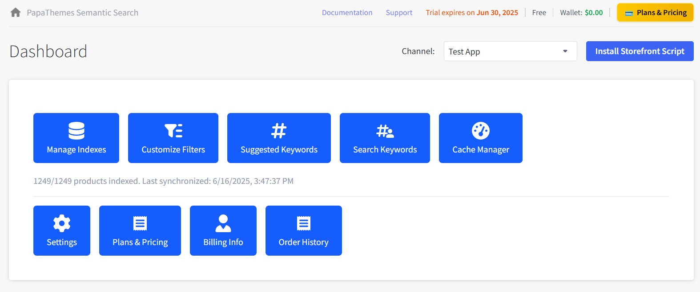

# Chapter 2: Dashboard Overview

The Dashboard is the main control center of your PapaSearch app. This chapter will explain every element, button, and feature you'll find on the Dashboard.

## Dashboard Layout

When you first open the app, you'll see the Dashboard with several key sections:

---

## Header Section

### App Navigation

At the top of the Dashboard, you'll see:

1. **App Title**: "PapaSearch" with the home icon
2. **Navigation Links**: Documentation, Support links
3. **Trial Info**: "Trial expires on Jun 27, 2025"
4. **Plan Info**: "Starter AI" plan with wallet balance "$280.00"
5. **Plans & Pricing**: Yellow button for subscription management

---

## Channel and Script Management

### Channel Selection

Below the header, you'll find:

1. **Channel Dropdown**: Shows current channel (e.g., "Test App")
2. **Script Status Button**: "Remove Storefront Script" (blue button on the right)

#### How to Change Channels:
1. Click the "Channel:" dropdown
2. Select the desired channel from the list
3. The page will refresh to show data for that channel

#### Script Management:
- **Remove Storefront Script**: Click to uninstall the frontend script
- **Install Storefront Script**: Appears when script is not installed

---

## Product Index Status

Below the channel section, you'll see the current product sync status:

**"1/1249 products indexed. Last synchronized: 6/16/2025, 4:30:43 PM"**

This shows:

- **Products Indexed**: How many products are currently searchable
- **Total Products**: Total products in your BigCommerce store
- **Last Sync**: When the product index was last updated

---

## Main Action Buttons

The Dashboard contains two rows of large, colorful buttons organized by function:

### Top Row - Core Features

#### 1. Manage Indexes
- **Function**: Opens product index management page
- **When to use**: To sync products and manage your search database

#### 2. Customize Filters
- **Function**: Opens filter customization page
- **When to use**: To modify which filters appear on your storefront

#### 3. Suggested Keywords
- **Function**: Opens keyword management for search suggestions
- **When to use**: To add, remove, or manage search keywords

#### 4. Search Keywords
- **Function**: Shows customer search analytics and allows adding popular search terms to Suggested Keywords
- **When to use**: To analyze what customers are searching for and add trending keywords as suggestions

#### 5. Cache Manager
- **Function**: Opens cache management for performance optimization
- **When to use**: To clear cache or monitor performance

### Bottom Row - Account Management

#### 6. Settings
- **Function**: Opens app configuration settings
- **When to use**: To configure search behavior and theme integration

#### 7. Plans & Pricing
- **Function**: Opens subscription and billing management
- **When to use**: To upgrade plans or manage billing

#### 8. Billing Info
- **Function**: Opens billing information form
- **When to use**: To update payment and contact details

#### 9. Order History
- **Function**: Shows past transactions and invoices
- **When to use**: To review payment history

---

## Understanding Dashboard Features

### Product Sync Management

The product sync status shown above the main buttons tells you:

- **Current Status**: How many products are indexed and searchable
- **Last Update**: When the search database was last synchronized
- **Total Products**: Complete product count in your BigCommerce store

#### When to Sync Products:
- **New products added**: After adding products to BigCommerce
- **Product changes**: When you modify existing product information
- **Automatic sync**: Products sync automatically every 15, 30, or 60 minutes (configurable in Settings)

### Script Installation Status

The "Remove Storefront Script" button indicates the frontend script is currently installed. This script enables:

- **Search functionality**: Powers the search bar on your storefront
- **Filter functionality**: Enables product filtering capabilities

#### Script Management:

- **Remove Storefront Script**: Click to uninstall the frontend functionality
- **Install Storefront Script**: Button appears when script needs to be installed
- **Automatic Updates**: Script updates are handled automatically

---

## Getting Started with Dashboard

### First Time Setup

After installing the app, here's what you should do:

1. **Install Storefront Script**: Click the "Install Storefront Script" button to activate search and filter functionality on your storefront
2. **Verify Script Installation**: Check that the button changes to "Remove Storefront Script" (meaning script is successfully installed)
3. **Review Product Count**: Check how many products are indexed vs total
4. **Explore Features**: Click through each button to familiarize yourself with available tools

### Common Dashboard Actions

#### Managing Products:

- Click **"Manage Indexes"** to sync products when you add or modify items in BigCommerce
- Monitor the product count status to ensure all products are indexed

#### Customizing Search:

- Use **"Customize Filters"** to control which filters appear on your storefront
- Add search terms with **"Suggested Keywords"** to help customers find products
- Monitor customer behavior with **"Search Keywords"** and add popular search terms to Suggested Keywords

#### Performance & Settings:

- Clear cache when needed using **"Cache Manager"**
- Adjust app behavior through **"Settings"**
- Manage billing and subscription via **"Plans & Pricing"**

---

## Quick Troubleshooting

### Common Issues:

**Script Not Working**: If search/filters don't work on storefront, check if script button shows "Install Storefront Script" instead of "Remove Storefront Script" - if so, click "Install Storefront Script" to activate the functionality.

**Outdated Search Results**: If search results seem outdated, use "Manage Indexes" to sync your products.

**Missing Features**: Some buttons may be disabled based on your subscription plan - check "Plans & Pricing" for upgrades.

**Search Results Issues**: Use "Cache Manager" to clear cache if search results are not displaying correctly.

---

## Dashboard Navigation

Each button on the dashboard takes you to a specific management area:

- **Manage Indexes**: Product sync and search database management
- **Customize Filters**: Filter configuration and display settings
- **Suggested Keywords**: Search term management and suggestions
- **Search Keywords**: Customer search analytics and ability to add popular terms to Suggested Keywords
- **Cache Manager**: Performance optimization and cache control
- **Settings**: App configuration and behavior settings
- **Plans & Pricing**: Subscription management and billing
- **Billing Info**: Payment method and contact information
- **Order History**: Transaction history and invoices

---

**Dashboard Overview Complete!** 🎯

You now understand the dashboard layout and can navigate to any feature you need to manage your search functionality.