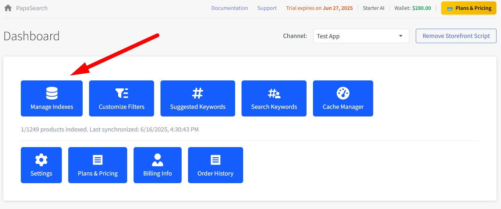
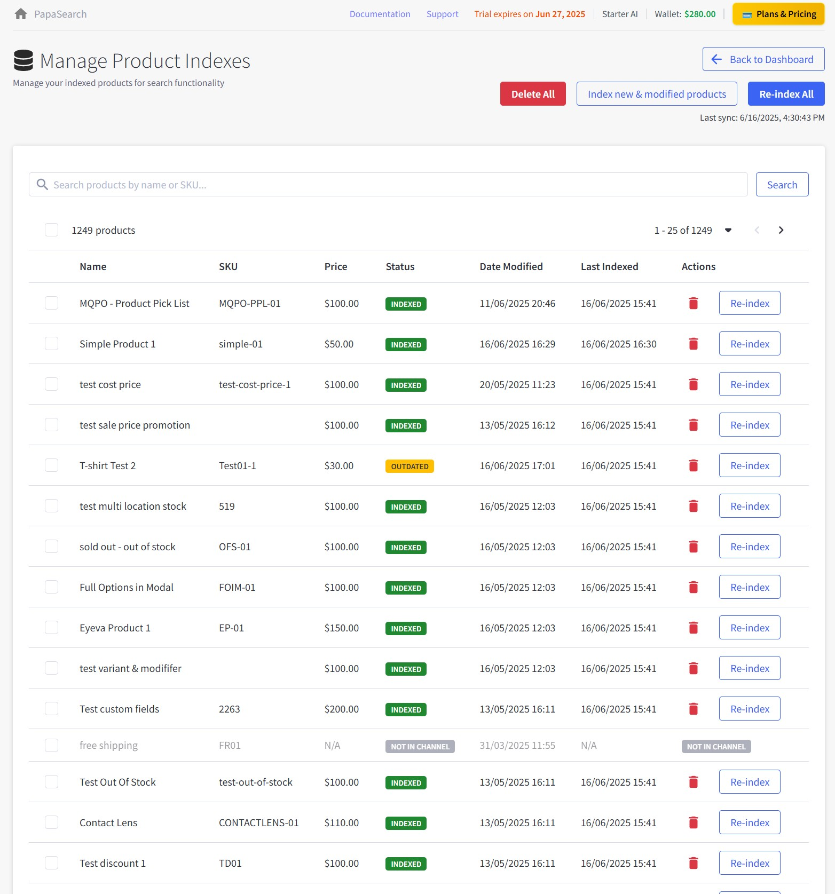
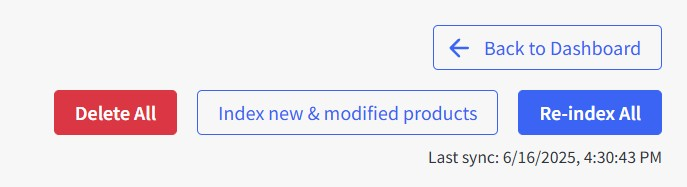
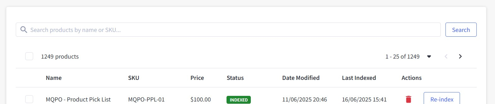
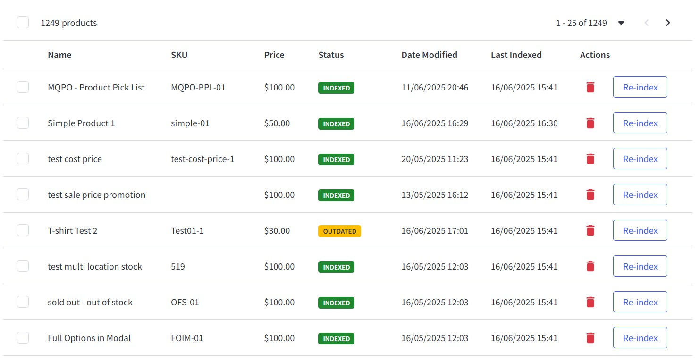
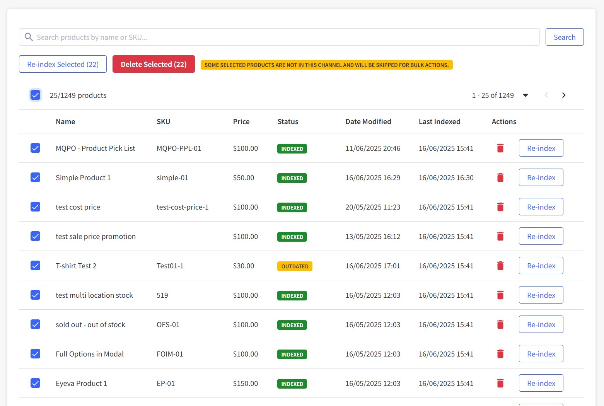
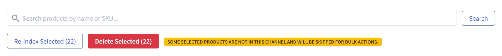

# Chapter 3: Product Index Management

The Product Index Management page is where you control which products are searchable in your store and manage the synchronization process. This chapter explains every feature and function on this important page.

## Accessing Product Index Management

From the Dashboard, click the **"Manage Indexes"** button (blue button with database icon).

---

## Page Overview

### Key Features

- **Product search control**: Manage which products are searchable in your store
- **Sync operations**: Keep product data updated in search index
- **⚠️ Important**: Last sync information shows when products were updated - monitor this regularly
- **Quick access**: Back to Dashboard button for easy navigation

---

## Main Action Buttons

### Top Action Bar

#### 1. Back to Dashboard Button

- **Function**: Returns to main dashboard
- **When to use**: When you're done managing indexes

#### 2. Delete All Button

- **Function**: Removes ALL products from the search index (not from your BigCommerce store)
- **Purpose**: Use this to exclude all products from search results
- **⚠️ Warning**: Products will not appear in search until re-indexed

**When to use Delete All:**

- Remove all products from search results temporarily
- Troubleshooting search issues
- Starting fresh with search index

**How to use Delete All:**

1. Click the "Delete All" button
2. Confirm deletion in the dialog
3. All products will be removed from search index
4. Products remain in your BigCommerce store
5. Re-index products to make them searchable again

#### 3. Index new & modified products Button

- **Function**: Only syncs products that have changed since last sync
- **Time**: Depends on number of products to be indexed

**When to use Index new & modified products:**

- When products are not indexed correctly
- When webhook is not enabled in Settings for automatic sync
- After manually adding or editing products in BigCommerce
- Regular maintenance if automatic sync is disabled

**How to use Index new & modified products:**

1. Click "Index new & modified products" button
2. The indexing process starts immediately
3. Monitor progress on the page

#### 4. Re-index All Button

- **Function**: Completely rebuilds the search index from scratch
- **Time**: Depends on total number of products in catalog

**When to use Re-index All:**

- First-time setup
- After major product changes
- If search results seem outdated

---

## Search and Filter Controls

You can search for specific products and adjust how the list is displayed:

### Search Products

- Type product name or SKU in the search box
- Press Enter or click "Search" button to find products
- Results will show immediately in the table below

### Adjust Product Display

- Choose how many products to show per page (10, 25, 50, 100)
- Page will automatically update with new results
- Default shows 25 products per page

---

## Product Index Table

This table shows all products in your search index. You can see their current status and take actions on individual products or groups of products.

### What You'll See in the Table

**Checkbox**: Select products to perform bulk actions (first column)

**Name**: The product name exactly as it appears in your BigCommerce store. Click the header to sort alphabetically.

**SKU**: Product identifier. Useful for finding specific products quickly.

**Price**: Current product price with currency symbol. Click header to sort by price.

**Status**: Shows whether the product is searchable or needs attention:

- 🟢 **INDEXED** - Product is fully searchable
- 🟡 **OUTDATED** - Product was changed and needs to be re-indexed
- ⚪ **NOT IN CHANNEL** - Product not available in current sales channel

**Date Modified**: When the product was last updated in BigCommerce

**Last Indexed**: When the product was last added to search index

**Actions**: Contains a "Re-index" button to update individual products

### Working with Individual Products

**Re-indexing a single product**: If you've updated a product in BigCommerce and want to make sure the changes appear in search results, click the "Re-index" button next to that product. You'll see a confirmation message when it's done.

---

## Bulk Operations

### Selecting Multiple Products

To perform operations on multiple products:

1. **Select individual products**: Check boxes next to desired products
2. **Select all on page**: Check the header checkbox
3. **Select all matching search**: Use "Select All" option if available

### Working with Multiple Products

Once you select products with checkboxes, you'll see action buttons appear to work with all selected products at once:

**Reindex Selected**: Updates all selected products in the search index. Processing time depends on how many products you've selected.

**Delete Selected**: Removes selected products from search results (they stay in your BigCommerce store). ⚠️ This action removes products from search until you re-index them.

**To use these features**: Simply check the products you want to work with, click the action button you need, confirm your choice, and wait for the process to finish.

---

## Pagination and Navigation

Above the product table, you'll find controls to help you navigate through your product list:

**Product count display**: Shows how many products you're viewing (like "1 - 25 of 1249 products")

**Page navigation**: Use the page numbers or arrow buttons to move between pages of products

**Items per page**: Choose how many products to display at once - select from options like 10, 25, 50, or 100 products per page

This makes it easy to browse through large product catalogs and find exactly what you're looking for.

---

## Checking Product Index Status

Products in the table have different statuses:

- 🟢 **INDEXED**: Product is searchable and up to date. No action needed.
- 🟡 **OUTDATED**: Product was changed and needs to be re-indexed to update search results.
- ⚪ **NOT IN CHANNEL**: Product isn't available in the current sales channel. Check your channel settings if needed.

---

## Troubleshooting Index Issues

Having trouble with your product index? Here are some common issues and quick solutions:

### 🔍 Products not appearing in search

- Product not indexed (removed from search index)
- Product disabled in BigCommerce
- Search settings exclude product

**What to do:**

1. Check product status in the table
2. Re-index the product if needed
3. Make sure the product is enabled in BigCommerce
4. Review your search settings

### 🕒 Search results are outdated

- Product was changed but not re-indexed
- Cache is showing old results

**What to do:**

1. Run "Index new & modified products"
2. Clear cache in Cache Manager
3. Check the last sync time

### 🐢 Sync is slow or fails

- Large product catalog
- Server or network issues

**What to do:**

1. Try syncing fewer products at a time
2. Check your internet connection
3. Contact support if you have a very large catalog (>10k products)
4. Try syncing during off-peak hours

### ❓ Some products missing from the table

- Channel restrictions
- Product visibility settings
- Search filters applied

**What to do:**

1. Check your channel selection
2. Clear any filters
3. Make sure the product is visible in BigCommerce
4. Check other pages in the table

---

## How to Use This Page

- Use this page mainly to check if your products are indexed correctly for search.
- If you have enabled automatic updates via webhook in Settings, you usually don't need to do anything here.
- If you notice products are not indexed or search results are outdated, just use the re-index feature.
- Outages (products not syncing correctly) are rare and usually only happen if there was an error during sync. In that case, re-index to fix.

---

## Automate Your Product Sync

To keep your product index up to date effortlessly, consider enabling automatic product sync in your settings. This feature allows your store to automatically check and index new or changed products.

### Sync Frequency Options

- Set the frequency of automatic checks to suit your needs:
  - Every 15 minutes
  - Every 30 minutes
  - Every 1 hour

By automating this process, you ensure that your product data is always current, saving you time and reducing manual effort.

---

## Integration with Other Features

### Relationship to Other Pages

#### Filter Customization:

- Products must be indexed to appear in filters
- Changes to products may affect filter options
- Reindexing updates filter data

#### Keyword Management:

- Search keywords work better with fully indexed products
- Product names and descriptions feed into keyword suggestions

#### Analytics:

- Search analytics depend on indexed products
- Product performance tracking requires current index

---

**Product Index Mastery Complete!** 📊

You now understand how to manage your product search index effectively, ensuring customers can find exactly what they're looking for.