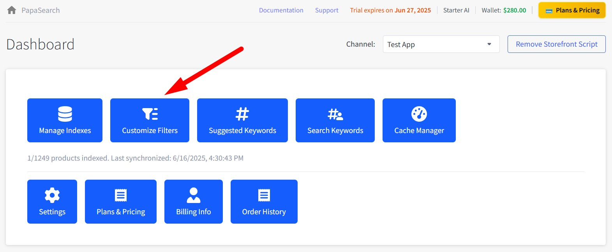
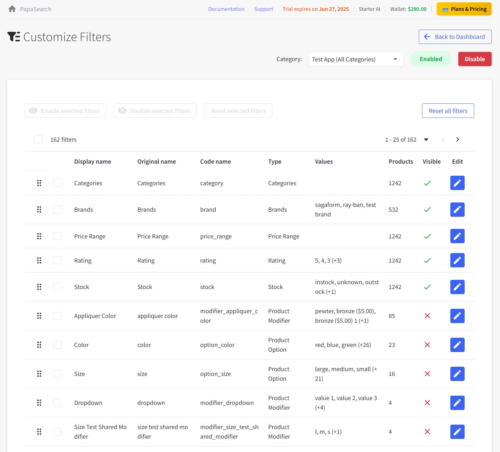
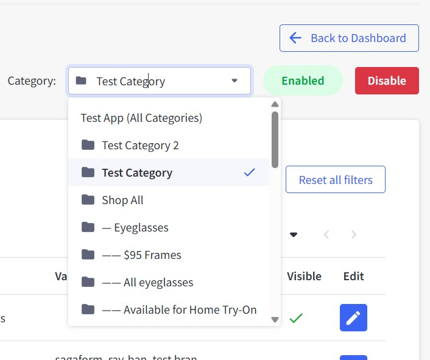
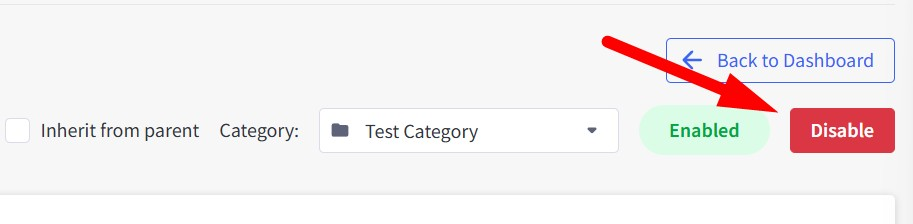
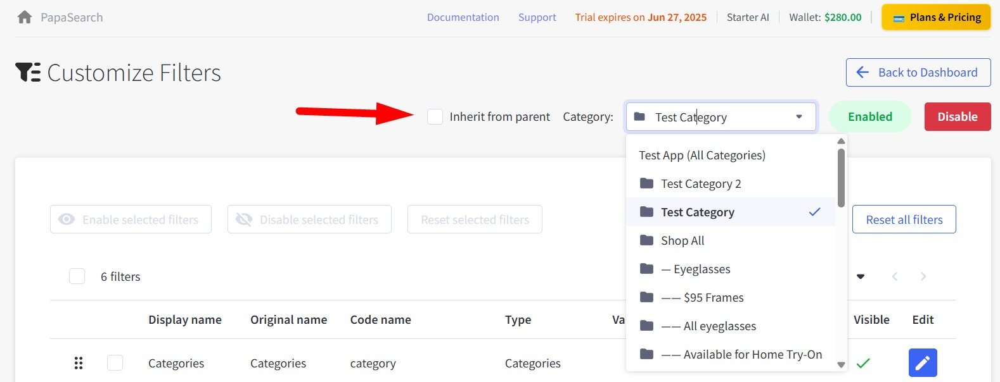

# Chapter 4: Customize Filters

Control which filters appear on your store and how they work. This page lets you show or hide filters to help customers find products easier.

## Getting to Customize Filters

From your Dashboard, click the **"Customize Filters"** button (the blue button with a filter icon).

---

## Page Layout

The page has these main parts:

- **Back to Dashboard** button (top left)
- **Category selector** to choose which category to work with
- **Enable/Disable** switches for the whole category
- **Filters table** showing all your available filters

---

## Choosing a Category

Use the dropdown to pick which category you want to customize filters for:

### Category Options

**Test App (All Categories)** - This is your current channel/store

- This represents the currently selected channel in your BigCommerce setup
- Changes here apply to all categories in this channel unless overridden by specific categories
- Good for setting up basic filters that work across your entire store

**Specific Categories** - Individual categories in your store

- Only affects that specific category and its subcategories
- Can override settings inherited from parent categories
- Allows you to customize filters for different category types

### How Category Selection Works

When you select a different category:

1. The page refreshes to show filters relevant to that category
2. You'll see which filters are available for that category and its subcategories
3. The filter count and product numbers update accordingly

### Category Hierarchy

Categories work in a parent-child relationship:

- **Parent Category**: "Electronics"
- **Child Categories**: "Phones", "Laptops", "Tablets"

Changes to a parent category can affect all its child categories, unless the child has its own specific settings.

---

## Enable or Disable Filters

### Filter Status Controls

**Enabled** (green button)

- Filters show up on your store pages
- Customers can use them to narrow down products
- Filter data is processed and cached for better performance

**Disabled** (red button)

- No filters appear on store pages
- Pages load faster since no filtering happens
- Good for categories that don't need filters (like single-product categories)

### How to Enable/Disable Filters

Click the Enable/Disable button next to the category name to toggle filters on/off. Changes take effect immediately.

### Inheritance Feature

**What is Inheritance?**

Inheritance means a child category automatically uses the same filter settings as its parent category.

**How It Works:**

- If you enable inheritance on a subcategory, it will copy all filter settings from its parent
- Any changes you make to the parent category will automatically apply to child categories with inheritance enabled
- Child categories can override inheritance by setting their own specific filter configurations

**When to Use Inheritance:**

- **Enable inheritance** when you want consistent filtering across related categories
- **Disable inheritance** when a category needs unique filters different from its parent

**Example:**

- Parent category: "Clothing" (has Size, Color, Brand filters enabled)
- Child category: "T-Shirts" (inherits Size, Color, Brand automatically)
- Child category: "Accessories" (disables inheritance, uses only Brand and Price filters)

### Setting Up Inheritance

1. Choose the child category from the dropdown
2. Look for inheritance controls (usually near the Enable/Disable buttons)
3. Enable inheritance to copy parent settings, or disable to set custom filters
4. Make your changes and they'll save automatically

---

## Your Filters Table

The table shows all filters available for your selected category:

### What Each Column Means

- **Display name** - What customers see on your store
- **Original name** - The technical name from your product data
- **Code name** - Internal system name
- **Type** - What kind of filter it is (Brand, Price Range, etc.)
- **Values** - The actual filter options (like specific brand names)
- **Products** - How many products use this filter
- **Visible** - Whether it shows on your store (✅ = visible, ❌ = hidden)
- **Edit** - Button to change filter settings

### Filter Types You'll See

- **Categories** - Filter by product categories
- **Brands** - Filter by manufacturer or brand name
- **Price Range** - Filter by price brackets
- **Rating** - Filter by customer review stars
- **Stock** - Filter by in stock/out of stock
- **Custom Fields** - Filter by product custom fields you've added in products.
- **Product Modifiers** - Custom attributes like color, size, material
- **Product Options** - Variants like size and color choices

---

## Managing Individual Filters

### Show or Hide Filters

Click the **Visible** column to toggle:

- **✅ Green checkmark** = Filter appears on your store
- **❌ Red X** = Filter is hidden from customers

### Edit a Filter

Click the blue **Edit** button to:
- Change what the filter is called
- Control how many options show at once
- Reorder the filter options
- Set other display preferences

### Reset a Filter

Use reset options to restore a filter back to its original settings if you've made changes that aren't working well.

---

## Bulk Actions

Select multiple filters using the checkboxes to:

- **Enable selected filters** - Make several filters visible at once
- **Disable selected filters** - Hide multiple filters
- **Reset selected filters** - Restore several filters to defaults

---

## Managing Filter Order

Drag and drop table rows to change the order filters appear on your store. Put the most useful filters first since customers see those first.

**Good filter order:**

1. Price Range (most people filter by price)
2. Brand (if you have multiple brands)
3. Category (helps narrow down product types)
4. Other specific attributes (size, color, etc.)

---

## Tips for Better Filters

### Choose the Right Filters

- Only show filters that actually help customers
- Hide filters that have just one option (not useful)
- Focus on what customers actually search for

### Using Custom Fields Effectively

Custom fields are powerful filters you can create for unique product attributes:

**Examples of useful custom fields:**

- Material (Leather, Cotton, Polyester)
- Warranty Period (1 Year, 2 Years, Lifetime)
- Country of Origin (Made in USA, Made in China)
- Certification (Organic, Fair Trade, FDA Approved)

**Setting up custom fields:**

1. First, add custom fields to your products in BigCommerce admin
2. Make sure the custom field values are consistent across products
3. Return to PapaSearch to see the new custom field filters appear
4. Enable visibility for the custom fields you want customers to use

### Keep It Simple

- Use clear, simple names customers understand
- Don't show too many filters at once
- Group related filters together

### Regular Maintenance

- Check monthly for filters with no products
- Hide or remove unused filters
- Update filter names if they're confusing customers

---

## Common Issues

**Filter not showing up?**

- Check if it's set to visible (✅ green checkmark)
- Make sure the category has filters enabled
- Verify products actually have that attribute

**No options in a filter?**

- Products might not have that attribute set
- Try reindexing your products
- Check your product data in BigCommerce

**Filter showing too many options?**

- Edit the filter to limit how many options display
- Clean up duplicate or similar values in your product data

---

**You're now ready to customize filters!** Your customers will have an easier time finding exactly what they're looking for.