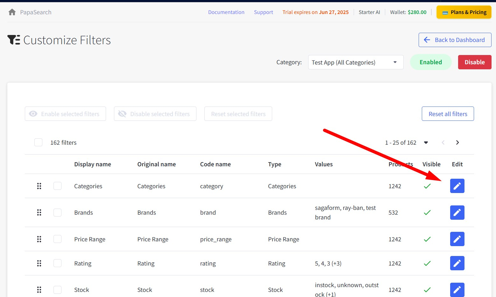
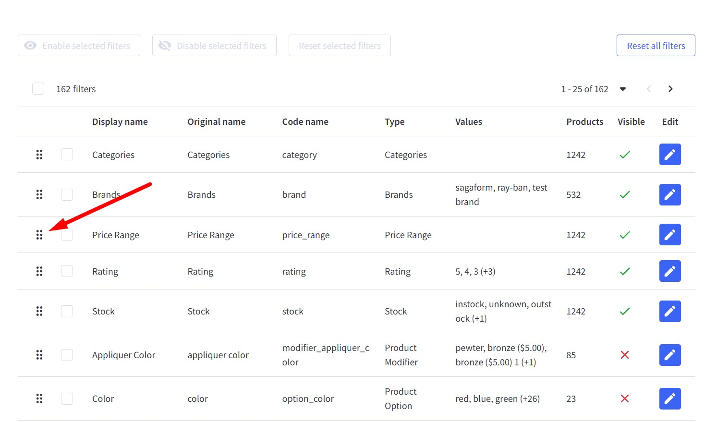
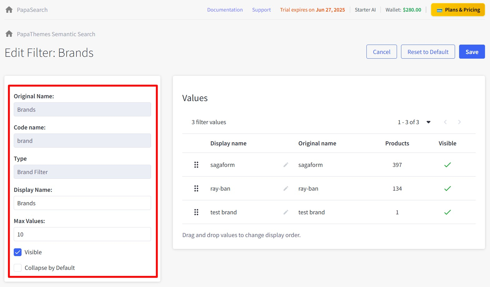
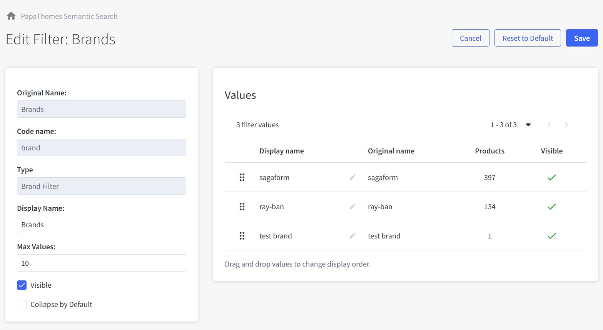
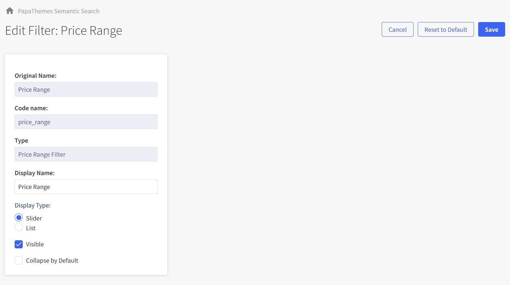
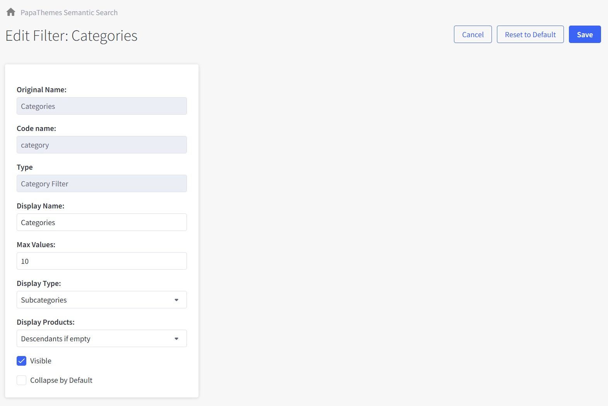
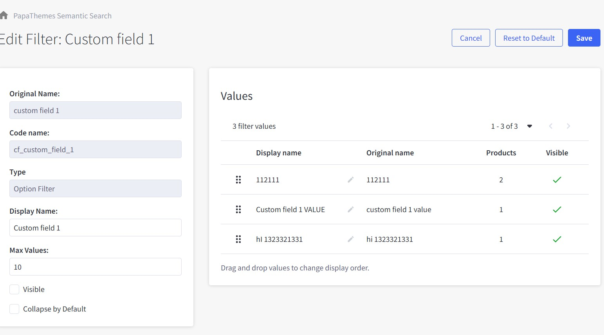
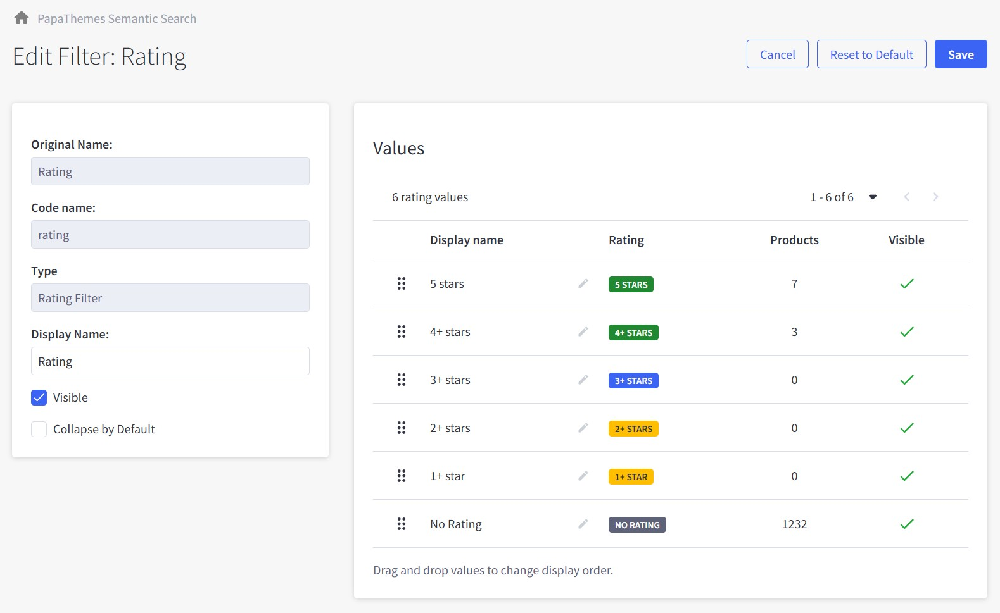

# Chapter 5: Individual Filter Editing

Configure individual filters to control how customers search and filter products on your storefront.

---

## Accessing Filter Edit Mode

1. Navigate to **Dashboard** → **Customize Filters**
2. Select your **Category** from the dropdown
3. Click the **"Edit"** button (pencil icon) for any filter

---

## Reordering Filters

Change filter display order using drag and drop. Click and hold the ⋮⋮ icon, then drag to reorder.

**Tip**: Place most important filters at the top. Order is automatically saved.

---

## Universal Filter Settings

Configure these common options for all filter types:

#### Original Name
System-generated field name (read-only).

#### Code Name
Internal identifier used by the system (read-only).

#### Type
Filter type classification (read-only).

#### Display Name
Customer-facing label on storefront. Use clear, simple names.

#### Max Values
Maximum number of options displayed (default: 10).

**How it works:**
- **With value**: Shows only the specified number of options, additional options appear in scrollable area
- **Empty/blank**: Shows all available options without scrollbar, no limit

**Example:**
- Set to "5": Shows first 5 brand options, remaining brands accessible via scroll
- Leave blank: Shows all 20+ brands in expanded list without scrolling

#### Visible
Check to show filter on storefront.

#### Collapse by Default
Check to start filter in collapsed state.

---

## Filter Type-Specific Settings

### Brand Filter

Configure how customers filter products by brand on your storefront.

#### Settings:
- **Display Name**: Label shown to customers (default: "Brands")
- **Max Values**: Number of brand options displayed at once (default: 10)
- **Visible**: Check to show filter on storefront
- **Collapse by Default**: Check to start filter in collapsed state

#### Brand Values:
- View all available brands with product counts
- Use ⋮⋮ handles to drag and reorder brand display order
- Click ✏️ (pencil icon) to edit individual brand display names
- Toggle individual brand visibility with checkmarks
- Higher product count brands typically perform better at the top

### Price Filter

Configure how customers filter products by price range on your storefront.

#### Settings:
- **Display Name**: Label shown to customers (default: "Price Range")
- **Display Type**: Choose between Slider or List format

  - **Slider**: Draggable range selector (good for wide price ranges)
  - **List**: Predefined price brackets (good for specific tiers)

- **Visible**: Check to show filter on storefront
- **Collapse by Default**: Check to start filter in collapsed state

#### Price Ranges:
Price ranges are automatically generated based on your product prices and store currency. The system creates appropriate brackets that update when you add new products.

### Category Filter

Configure how customers filter products by category on your storefront.

#### Settings:
- **Display Name**: Label shown to customers (default: "Categories")
- **Max Values**: Number of category options displayed at once (default: 10)
- **Display Type**: Choose how categories are shown

  - **Subcategories**: Show only immediate child categories
  - **All Descendants**: Show all subcategories and their children
  - **Entire Tree**: Show complete category structure

- **Display Products**: Control empty category visibility

  - **Descendants if empty**: Show categories even without direct products
  - **Hide if empty**: Only show categories with products

- **Visible**: Check to show filter on storefront
- **Collapse by Default**: Check to start filter in collapsed state

### Custom Field, Modifier & Option Filters

Configure filters for product custom fields, modifiers, and options like Size, Color, Material, etc.

#### Settings:
- **Original Name**: System field name (read-only)
- **Code Name**: Internal identifier (read-only)
- **Type**: Filter classification (read-only)
- **Display Name**: Label shown to customers (editable)
- **Max Values**: Number of options displayed at once (default: 10)
- **Visible**: Check to show filter on storefront
- **Collapse by Default**: Check to start filter in collapsed state

#### Custom Field Values:
- View all available field values with product counts
- Use ⋮⋮ handles to drag and reorder value display order
- Click ✏️ (pencil icon) to edit individual value display names
- Toggle individual value visibility with checkmarks
- Values are automatically populated from your product custom fields

**Note**: This same configuration applies to Product Modifier filters and Product Option filters with identical settings and functionality.

### Rating Filter

Configure how customers filter products by review ratings on your storefront.

#### Settings:
- **Original Name**: System field name (read-only)
- **Code Name**: Internal identifier (read-only)
- **Type**: Filter classification (read-only)
- **Display Name**: Label shown to customers (default: "Rating")
- **Visible**: Check to show filter on storefront
- **Collapse by Default**: Check to start filter in collapsed state

#### Rating Values:
- View all available rating thresholds with product counts
- Pre-defined options: 5 stars, 4+ stars, 3+ stars, 2+ stars, 1+ star, No Rating
- Use ⋮⋮ handles to drag and reorder rating display order
- Click ✏️ (pencil icon) to edit individual rating display names
- Toggle individual rating visibility with checkmarks
- Color-coded badges help distinguish different rating levels

### Stock Status Filter

Configure how customers filter products by stock availability on your storefront.

#### Settings:
- **Original Name**: System field name (read-only)
- **Code Name**: Internal identifier (read-only)
- **Type**: Filter classification (read-only)
- **Display Name**: Label shown to customers (default: "Stock")
- **Visible**: Check to show filter on storefront
- **Collapse by Default**: Check to start filter in collapsed state

#### Stock Values:
- View all available stock status options with product counts
- Pre-defined options: In Stock, Unknown, Out of Stock, Low Stock
- Use ⋮⋮ handles to drag and reorder stock status display order
- Click ✏️ (pencil icon) to edit individual status display names
- Toggle individual status visibility with checkmarks
- Stock levels are automatically determined by your BigCommerce inventory settings

---

## Filter Logic & Behavior

Understanding how filters work together when customers make selections:

### Multiple Values in Same Filter (OR Logic)
When customers select multiple options within a single filter, results show products matching **ANY** of the selected values:

**Example - Brand Filter:**
- Customer selects: "Apple" + "Samsung"
- Results show: Products from Apple **OR** Samsung brands

### Multiple Different Filters (AND Logic)
When customers select options from different filters, results show products matching **ALL** filter conditions:

**Example - Multiple Filters:**
- Customer selects: Brand = "Apple" + Color = "Red" + Price = "$100-200"
- Results show: Products that are Apple **AND** Red **AND** priced $100-200

### Practical Example:
If a customer selects:
- **Brands**: Apple, Samsung (OR logic within Brand filter)
- **Colors**: Red, Blue (OR logic within Color filter)
- **Price**: $100-200

Results will show: Products that are **(Apple OR Samsung) AND (Red OR Blue) AND ($100-200)**

This logic provides intuitive filtering that matches customer expectations and shopping behavior.

---

## Performance & Best Practices

### Recommended Limits:
- Recommend 20 filters or fewer per category for optimal performance
- Default 10 values per filter (adjustable via Max Values setting)
- Higher numbers may impact page load speed

### Category-Specific Customization:
Each category can have different filter configurations:

- **Electronics**: Brand, Price, Rating, Stock filters
- **Clothing**: Brand, Size, Color, Material, Price filters
- **Home & Garden**: Category, Price, Material, Color filters

### Inheritance Feature:
Use filter inheritance to save time and maintain consistency:

- **Parent Category Setup**: Configure filters once on main category
- **Child Categories**: Automatically inherit parent filters
- **Auto-Updates**: Changes to parent filters automatically apply to children
- **Override Option**: Child categories can customize inherited filters if needed

### Benefits of Inheritance:
- Reduces manual configuration work
- Ensures consistent filter experience
- Automatic updates across related categories
- Easy bulk management of filter changes

---

## Quick Tips

- **Filter Names**: Use customer-friendly language, avoid technical terms
- **Max Values**: Set limits for large catalogs, leave blank for small ones
- **Order Matters**: Place most important filters at the top
- **Test Regularly**: Check filter behavior on both desktop and mobile
- **Monitor Usage**: Use analytics to see which filters customers use most

---

**Next Steps**: After configuring your filters, move on to [Chapter 6: Keyword Management](./06-keywords.md) to optimize search functionality.

---

*Need help with filter configuration? Contact our support team through the app dashboard.*