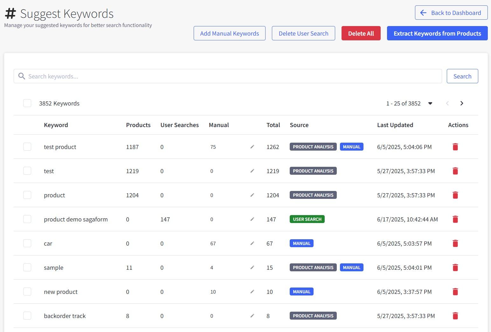
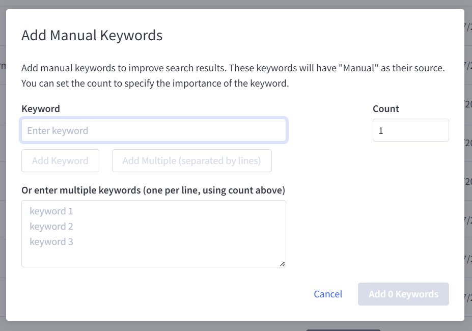

# Chapter 6: Keyword Management

Manage suggested keywords that appear when customers type in your search box to improve search experience and help customers find products faster.

---

## Accessing Keyword Management

1. Navigate to **Dashboard** → **Suggest Keywords** (hashtag icon)
2. The page shows all your current keywords with management options



---

## Keyword Management Interface

### Main Action Buttons

Located at the top of the page:

#### Add Manual Keywords

Add specific keywords you want to promote in search suggestions.

#### Delete User Search

Delete keywords to prevent them from appearing in search suggestions.

#### Delete All

Clear all keywords.

#### Extract Keywords from Products

Automatically generate keywords from your product catalog (names, descriptions, brands, etc.).

---

## Keyword Table Overview

The table displays all keywords with the following information:

### Table Columns:

**Keyword**

- The actual search term customers see

**Products**

- Number of products that match this keyword
- Higher numbers indicate better keyword coverage

**User Searches**

- Number of times customers searched for this term before merging into this table
- This count does not update after the keyword is added to the table

**Manual**

- Used to adjust priority level of this keyword
- Click ✏️ (pencil icon) to edit manual count

**Total**

- Combined total from all sources
- Overall relevance score for the keyword

**Source**

- Shows how the keyword was created:
    - **PRODUCT ANALYSIS**: Auto-generated from product data
    - **MANUAL**: Added manually by you
    - **USER SEARCH**: Merged from User Search Keywords into Suggested Keywords

**Last Updated**

- When the keyword was last modified
- Helps track recent changes

**Actions**

- 🗑️ Delete button to remove individual keywords

---

## Adding Manual Keywords

1. Click **"Add Manual Keywords"** button
2. The Add Manual Keywords dialog appears with options:



### Single Keyword Method:

- Enter keyword in the **Keyword** field
- Set **Count** value to specify importance (default: 1, higher = more important)
- Click **"Add Keyword"** or **"Add Multiple (separated by lines)"**

### Multiple Keywords Method:

- Use the text area: **"Or enter multiple keywords (one per line, using count above)"**
- Enter one keyword per line
- All keywords will use the same Count value set above
- Example format:
  ```
  wireless headphones
  gaming laptop
  summer dresses
  ```

### Count/Importance Setting:

- **Count**: Determines keyword priority in search suggestions
- **Higher count**: Keyword appears higher in search suggestions

3. Click **"Add 0 Keywords"** button to save (number updates based on keywords entered)

**Examples of good manual keywords:**

- Brand names: "apple", "samsung", "nike"
- Product categories: "wireless headphones", "running shoes"
- Seasonal terms: "christmas gifts", "back to school"

---

## Extract Keywords from Products

Use this feature to automatically generate keywords from your existing products:

1. Click **"Extract Keywords from Products"** button
2. The system analyzes your product catalog
3. Keywords are extracted from:
    - Product names
    - Product descriptions
    - Brand names
    - Category names
    - Custom fields

**Benefits:**

- Saves time on manual keyword entry
- Ensures keywords match your actual products
- Captures product terminology customers use
- Updates automatically when you add new products

---

## Managing Existing Keywords

### Search and Filter

- Use the search box to find specific keywords
- Filter by keyword type or source
- Sort by any column (Products, User Searches, Total, etc.)

### Bulk Operations

- Select multiple keywords using checkboxes
- Use bulk actions to delete multiple keywords at once
- Monitor the total count (e.g., "3852 Keywords" in the example)

### Individual Keyword Management

- **Edit Manual Count**: Click the ✏️ icon in the Manual column
- **Delete Single Keyword**: Click the 🗑️ icon in Actions column
- **View Details**: Click on any keyword to see more information

---

## Keyword Sources Explained

### PRODUCT ANALYSIS

Keywords automatically extracted from your product data:

- High reliability since they match actual products
- Updates when you add/modify products
- Usually highest "Products" count

### MANUAL

Keywords you've added specifically:

- Strategic keywords for important searches
- Brand names or category terms
- Seasonal or promotional keywords

### USER SEARCH

Keywords from actual customer searches:

- Shows real customer demand
- High "User Searches" count indicates popular terms
- Valuable for understanding customer language

---

## Best Practices

### Adding Manual Keywords:
- **Use strategic terms**: Add brand names, product categories, and seasonal keywords
- **Set appropriate count**: Use higher count (5-10) for important keywords
- **Customer language**: Use terms customers naturally search for
- **Avoid duplicates**: Check existing keywords before adding new ones

### Managing Keyword Sources:
- **PRODUCT ANALYSIS**: Let system auto-extract from your catalog regularly
- **MANUAL**: Add strategic keywords you want to promote
- **USER SEARCH**: Review and merge valuable customer search terms

### Quality Control:
- **Monitor "Products" column**: Remove keywords with zero matching products
- **Check "User Searches"**: Focus on keywords with actual customer demand
- **Use "Delete User Search"**: Remove irrelevant or poor quality search terms
- **Balance keyword count**: Don't add too many keywords that dilute search quality

### Maintenance Schedule:
- **Weekly**: Review User Search Keywords page and merge valuable terms
- **Monthly**: Run "Extract Keywords from Products" for new items
- **Quarterly**: Clean up keywords with zero products or low performance
- **Seasonally**: Add seasonal terms before peak periods, remove after

---

## Troubleshooting

### Keywords Not Appearing in Search Suggestions
1. Check if keyword exists in the table
2. Verify "Products" count is greater than 0
3. Ensure you have products that match the keyword
4. Clear cache if recently added

### No Keywords Being Generated
1. Verify your products have descriptions and titles
2. Run "Extract Keywords from Products"
3. Check if products are properly indexed
4. Contact support if extraction fails

### Too Many Irrelevant Keywords
1. Use "Delete User Search" to remove poor quality searches
2. Focus on keywords with good "Products" to "User Searches" ratio
3. Regularly clean up low-performing keywords

---

**Next Steps**: After optimizing your keywords, move on to [Chapter 7: User Search Analytics](./07-user-search-keywords.md) to track how customers search in your store.

---

*Need help with keyword strategy? Contact our support team for personalized recommendations.*