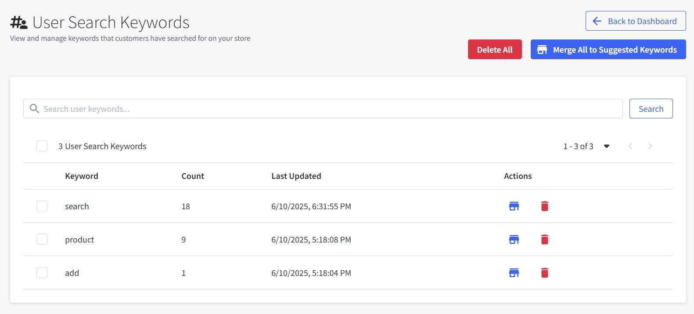

# Chapter 7: User Search Keywords

View and manage keywords that customers have searched for on your store to understand customer behavior and optimize search experience.

**Note**: User search keywords are automatically stored for 7 days only. Review and merge valuable keywords regularly to avoid losing important customer search data.

---

## Accessing User Search Keywords

1. Navigate to **Dashboard** → **User Search Keywords** (hashtag with user icon)
2. The page shows all customer search terms with management options

---

## User Search Keywords Interface

### Main Action Buttons

Located at the top of the page:

#### Delete All
Clear all user search keywords (use with caution).

#### Merge All to Suggested Keywords
Move all user search keywords to the Suggested Keywords table for search suggestions.

---

## User Search Keywords Table

The table displays customer search behavior with the following information:

### Table Columns:

**Keyword**

- The actual search term customers typed in your search box
- Shows real customer language and search patterns

**Count**

- Number of times customers searched for this term
- Higher numbers indicate popular search terms

**Last Updated**

- When this keyword was last searched by a customer
- Helps identify recent vs outdated search trends

**Actions**

- 📋 **Merge button**: Move individual keyword to Suggested Keywords
- 🗑️ **Delete button**: Remove individual keyword from tracking

---

## Understanding Customer Search Data

### What User Search Keywords Show You:

**Customer Language**

- How customers naturally describe your products
- Terms they use vs. how you name products
- Common misspellings or variations

**Search Patterns**

- Most popular search terms in your store
- Trending vs declining search interests
- Seasonal search behavior

**Business Opportunities**

- High-demand searches that could become suggested keywords
- Product gaps where customers search but find limited results
- Categories or brands customers are looking for

---

## Managing User Search Keywords

### Individual Keyword Actions

**Merge to Suggested Keywords**

1. Click the 📋 (merge) button next to any keyword
2. The keyword moves to Suggested Keywords table
3. It will now appear in search suggestions for customers

**Delete Individual Keywords**

1. Click the 🗑️ (delete) button next to any keyword
2. The keyword is removed from tracking
3. Use for irrelevant or inappropriate search terms

### Bulk Operations

**Merge All to Suggested Keywords**

- Moves all user search keywords to Suggested Keywords at once
- Useful for initial setup or bulk processing
- All keywords will become available as search suggestions

**Delete All**

- Removes all user search keywords from the system
- Use when you want to start fresh with search tracking
- Cannot be undone - use with caution

### Search and Filter

- Use the search box to find specific keywords
- Monitor total count (e.g., "3 User Search Keywords" in the example)
- Sort by any column (Keyword, Count, Last Updated)
- Select individual keywords using checkboxes for bulk actions
- Select multiple keywords to delete or merge in bulk

---

## Best Practices

### Regular Review Process:

- **Weekly**: Review new user search keywords for valuable terms
- **Merge valuable keywords**: Add popular searches to suggested keywords
- **Clean up irrelevant terms**: Delete inappropriate or irrelevant searches
- **Monitor search patterns**: Look for trends in customer behavior

### Deciding What to Merge:

**Good candidates for merging:**

- High count keywords (frequently searched)
- Product-related terms that match your inventory
- Brand names or category terms
- Descriptive terms customers use

**Keywords to delete:**

- Inappropriate or offensive terms
- Extremely rare searches (count of 1-2)
- Obvious typos or nonsensical terms
- Searches unrelated to your products

### Search Pattern Analysis:

- **High count keywords**: Popular terms customers are actively searching for
- **Recent last updated**: Current customer interests and trends
- **Consistent patterns**: Regular search terms worth promoting

---

## Integration with Suggested Keywords

### The Flow from User Search to Suggestions:

1. **Customer searches** → Term appears in User Search Keywords
2. **You review** → Decide if term is valuable for your business
3. **Merge to Suggested** → Term becomes available in search suggestions
4. **Future customers** → See this term when typing similar searches

### Benefits of This Process:

- **Customer-driven keywords**: Based on real search behavior, not guesswork
- **Relevant suggestions**: Terms that customers actually use
- **Continuous improvement**: Search suggestions evolve with customer behavior
- **Business control**: You decide which searches become suggestions

---

## Troubleshooting

### No User Search Keywords Appearing

1. Verify customers are using your search function
2. Check if search tracking is enabled in settings
3. Allow time for search data to accumulate
4. Contact support if searches should be tracking but aren't

### Too Many Irrelevant Keywords

1. Regularly clean up with individual delete actions
2. Use "Delete All" for fresh start if needed
3. Set up regular review schedule to stay on top of new searches
4. Focus on merging only high-quality, relevant terms

### Keywords Not Appearing in Suggestions After Merge

1. Clear cache if recently merged
2. Verify keywords were successfully moved to Suggested Keywords
3. Check if customers are typing similar terms to trigger suggestions
4. Allow time for search suggestions to update

---

**Next Steps**: After optimizing your user search keywords, move on to [Chapter 8: Cache Management](./08-cache-manager.md) to manage system performance.

---

*Need help understanding your customer search patterns? Contact our support team for guidance on optimizing your search keywords.*