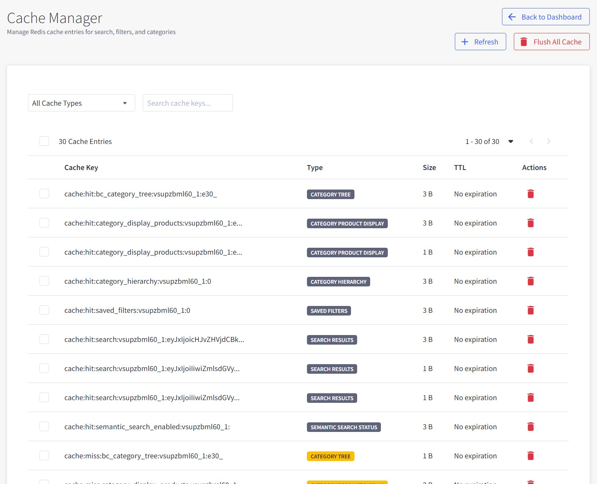

# Chapter 8: Cache Manager

Manage cache entries for search, filters, and categories to optimize store performance.

---

## Overview

Cache Manager helps you monitor and control cached data that speeds up your search functionality. Cached data includes search results, filter options, and category structures.

**Main Functions:**

- View all cache entries in your store
- Filter cache by type and search for specific keys
- Delete individual cache entries or flush entire cache types
- Monitor cache performance and storage usage

---

## Interface Elements

### Header Section

**Navigation:**

- **← Back to Dashboard** - Return to main dashboard
- **+ Refresh** - Reload current cache data
- **🗑️ Flush All Cache** - Delete all cache entries

### Filter Controls

**Cache Type Filter (Dropdown):**

- **All Cache Types** - Show all cache entries
- **Search Results** - Cached search query results
- **Category Tree** - BigCommerce category hierarchy
- **Category Product Display** - Product lists for categories
- **Category Hierarchy** - Category parent-child relationships
- **Saved Filters** - Saved filter configurations
- **Suggested Keywords** - Auto-complete keyword suggestions
- **Popular Keywords** - Most searched terms
- **Semantic Search Status** - AI search feature settings

**Search Box:**

- Search for specific cache keys by name or pattern

### Cache Entries Table

**Table Information:**

- Shows "X Cache Entries" count
- Pagination: "1 - 30 of 30" with navigation arrows

**Columns:**

- **Cache Key** - Unique identifier for the cached data
- **Type** - Cache category with colored badges
- **Size** - Storage space used (e.g., "3 B", "1 B")
- **TTL** - Time To Live expiration status ("No expiration")
- **Actions** - 🗑️ Delete button for each entry

---

## Cache Types Explained

### Search Results (`SEARCH RESULTS`)

- **Purpose**: Cached search query results for faster repeat searches
- **Example**: Customer searches for "wireless mouse" - results cached for instant loading
- **When to clear**: After product updates or search configuration changes

### Category Tree (`CATEGORY TREE`)

- **Purpose**: BigCommerce category structure for navigation menus
- **Example**: Electronics > Computers > Accessories hierarchy
- **When to clear**: After category structure changes in BigCommerce

### Category Product Display (`CATEGORY PRODUCT DISPLAY`)

- **Purpose**: Product display settings for categories (direct products vs subcategory products)
- **Example**: Electronics category shows only direct products, or includes products from Computers > Laptops subcategories
- **Display Options**: Direct products only, include subcategories, or show subcategory products when parent has none
- **When to clear**: After changing category product display settings or reorganizing category structure

### Category Hierarchy (`CATEGORY HIERARCHY`)

- **Purpose**: Parent-child relationships between categories
- **Example**: Which categories are subcategories of others
- **When to clear**: After reorganizing category structure

### Saved Filters (`SAVED FILTERS`)

- **Purpose**: Custom filter configurations saved in database
- **Example**: Specific brand and price filters for Electronics category
- **When to clear**: After changing filter settings in Customize Filters

### Suggested Keywords (`SUGGESTED KEYWORD`)

- **Purpose**: Auto-complete suggestions as customers type
- **Example**: Typing "lap" shows "laptop", "laptop bag", "laptop stand"
- **When to clear**: After updating keyword configurations

### Popular Keywords (`POPULAR`)

- **Purpose**: Most frequently searched terms
- **Example**: Top 10 search terms to prioritize in suggestions
- **When to clear**: Monthly to refresh trending searches

### Semantic Search Status (`SEMANTIC SEARCH STATUS`)

- **Purpose**: AI-powered search feature configuration
- **Example**: Whether semantic search is enabled for the store
- **When to clear**: After changing semantic search settings

---

## Cache Operations

### Delete Individual Cache Entry

1. Click the **🗑️ Delete** button next to any cache entry
2. Confirm deletion in the popup dialog
3. Cache entry is immediately removed

### Filter Cache Entries

1. Use the **Cache Type** dropdown to filter by specific type
2. Enter search terms in the **Search Box** to find specific keys
3. Table updates to show matching entries only

### Refresh Cache Data

1. Click the **+ Refresh** button in the header
2. Current cache data is reloaded from Redis
3. Table updates with latest cache information

### Flush All Cache

1. Click the **🗑️ Flush All Cache** button in header
2. Confirm action in warning dialog - this clears ALL cache data
3. All cache entries are immediately deleted
4. Cache rebuilds automatically as customers use the site

**⚠️ Warning**: Flushing all cache may slow site performance since data is no longer cached. Cache rebuilds gradually on first requests.

---

## When to Clear Cache

### Recommended Clearing Times:

**After Product Changes:**

- New products added or removed
- Product information updated (prices, descriptions, attributes)
- Product categories changed
- Clear: Search Results, Category Product Display

**After Search Configuration:**

- Filter settings modified in Customize Filters
- Search behavior settings changed
- Keyword configurations updated
- Clear: Saved Filters, Suggested Keywords

**After Category Changes:**

- Category structure reorganized in BigCommerce
- New categories added or removed
- Category names or descriptions changed
- Clear: Category Tree, Category Hierarchy

**Monthly Maintenance:**

- Refresh trending search data
- Clear old unused cache entries
- Update popular keywords
- Clear: Popular Keywords, old Search Results

### Performance Impact

**After Clearing Cache:**

- **Immediate**: Site searches will be slower for 30-60 minutes
- **Recovery**: Performance improves as cache rebuilds
- **Full Recovery**: 2-4 hours for complete cache rebuild

**Best Practice**: Clear cache during low-traffic hours (early morning or late evening).

---

## Troubleshooting

### Search Results Not Updating
- **Problem**: New products don't appear in search
- **Solution**: Clear "Search Results" cache type
- **Recovery**: 30-60 minutes for fresh results

### Filter Options Incorrect
- **Problem**: Filters show outdated options
- **Solution**: Clear "Saved Filters" cache type
- **Recovery**: 15-30 minutes for updated filters

### Category Navigation Issues
- **Problem**: Category menus show wrong structure
- **Solution**: Clear "Category Tree" cache type
- **Recovery**: 10-20 minutes for corrected navigation

### Slow Search Performance
- **Problem**: Searches taking too long to load
- **Solution**: Check if cache is working properly, clear old cache if needed
- **Prevention**: Monitor cache size and clear unused entries regularly

---

**Next Chapter**: [Settings](./09-settings.md) - Configure core search behavior and features.