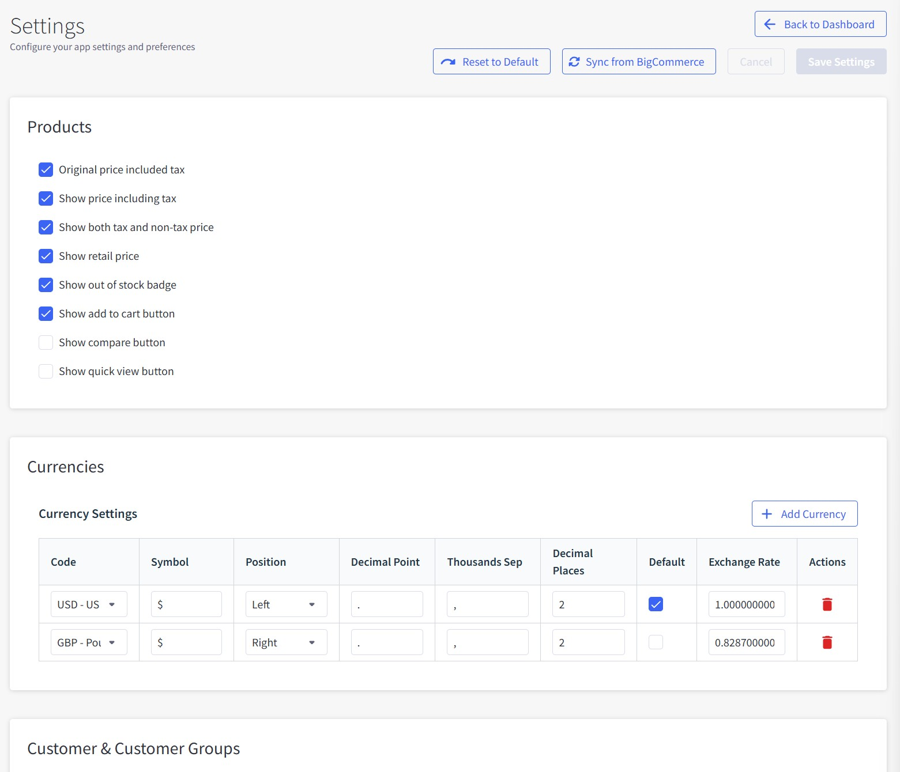

# Chapter 9: Settings

Configure your app settings and preferences to optimize search functionality.

---

## Overview

The Settings page allows you to configure core search behavior, product display options, currency settings, customer groups, filters, and indexing preferences.

**Main Functions:**

- Configure product display options and pricing
- Manage currencies and exchange rates
- Set up customer groups and guest access
- Configure filter selectors and behavior
- Adjust search parameters and sorting
- Enable semantic search and automatic indexing

---

## Interface Elements

### Header Section

**Navigation:**

- **← Back to Dashboard** - Return to main dashboard
- **🔄 Reset to Default** - Restore all settings to default values
- **🔄 Sync from BigCommerce** - Update settings from BigCommerce store
- **Save Settings** - Apply current configuration

---

## Products Section

### Product Display Settings

**Checkbox Options:**

- **✅ Original price included tax** - Show tax-inclusive prices
- **✅ Show price including tax** - Display prices with tax included
- **✅ Show both tax and non-tax price** - Display both tax-inclusive and tax-exclusive prices
- **✅ Show retail price** - Display manufacturer's suggested retail price (MSRP)
- **✅ Show out of stock badge** - Mark out-of-stock products with badges
- **✅ Show add to cart button** - Include "Add to Cart" buttons in search results
- **⬜ Show compare button** - Enable product comparison functionality
- **⬜ Show quick view button** - Add quick preview buttons for products

**Purpose:**

- Control what product information appears in search results
- Customize pricing display for different customer types
- Enable or disable interactive buttons on product listings

---

## Currencies Section

### Currency Settings

**Add Currency Button:**

- **+ Add Currency** - Add new currency support

**Currency Table Columns:**

- **Code** - Currency code (e.g., USD, GBP)
- **Symbol** - Currency symbol ($, £)
- **Position** - Symbol position (Left/Right)
- **Decimal Point** - Decimal separator (. or ,)
- **Thousands Sep** - Thousands separator (, or .)
- **Decimal Places** - Number of decimal places (usually 2)
- **Default** - Set as default currency (checkbox)
- **Exchange Rate** - Conversion rate to base currency
- **Actions** - 🗑️ Delete currency

**Current Currencies:**

- **USD - US** - Default currency ($, Left position, 1.000000000 rate)
- **GBP - Pound** - Secondary currency (£, Right position, 0.828700000 rate)

**Purpose:**

- Support multiple currencies for international customers
- Configure currency display format and positioning
- Set exchange rates for accurate pricing conversion

!!! info "💡 Sync Currency"
    Use "**Sync from BigCommerce**" button to automatically import currencies already configured in your BigCommerce store settings.

---

## Customer & Customer Groups Section

### Guest Customer Configuration

**Guest Customer Group ID:**

- **Field**: Numeric input (default: 0)
- **Description**: Customer group ID for guest shoppers (default: 0)
- **Purpose**: Define which customer group non-logged-in visitors belong to

### Customer Groups Table

**Synced from BigCommerce** indicator shows data source

**Table Columns:**

- **ID** - Customer group identifier (e.g., 0)
- **Name** - Group name (e.g., "Guest")
- **Default** - Whether this is the default group (-)
- **Guest Group** - Marked as guest group (👤 Guest icon)

**Info Note:**

!!! info "💡 Sync Customer Groups"
    Customer groups are managed in BigCommerce admin panel. Use "**Sync from BigCommerce**" button to update this list from your store settings.

**Purpose:**

- Configure customer group access and pricing
- Set default group for guest customers
- Sync customer group data from BigCommerce

---

## Filters Section

### Filter Container Selectors

**Filters container selector:**

- **Field**: Text input with default values
- **Value**: `#faceted-search-container, papasearch-sidebar`
- **Purpose**: CSS selectors for where filters appear on storefront

**Products container selector:**

- **Field**: Text input with default values
- **Value**: `#product-listing-container, papasearch-content`
- **Purpose**: CSS selectors for where search results appear

**⬜ Ajax category link:**

- **Checkbox**: Enable AJAX category navigation
- **Purpose**: Load category pages without full page reload when selecting category in filter
- **Benefits**: Faster category browsing, maintains current page state
- **Limitation**: Category descriptions and widgets may not update since the app only controls product display

!!! note "📝 AJAX Category Navigation"
    Enable this feature if you want category links in filters to load corresponding products without refreshing the entire page. However, category descriptions may not update because the app only controls product display, not widgets and other category-related sections.

**Purpose:**

- Define where filters and products display on your theme
- Enable smooth category navigation without page refreshes
- Integrate with existing theme structure

---

## Search Section

### Search Configuration

**Default products per page limit:**

- **Field**: Numeric input (default: 24)
- **Purpose**: Number of products shown per page in search results

**Default sort:**

- **Dropdown**: Sort order options
- **Selected**: "Relevance"
- **Options**: Relevance, Price Low-High, Price High-Low, Newest, Name A-Z, Name Z-A
- **Purpose**: Default sorting method for search results

**Search lowest score (only works when semantic search enabled):**

- **Field**: Numeric input (default: 1.5)
- **Purpose**: Minimum relevance threshold for displaying results
- **Range**: 0.0 (show all) to 2.0 (very strict)

**Checkbox Options:**

- **⬜ Redirect search page** - When searching from quick search box, redirect to dedicated search results page instead of showing results via AJAX on current page
- **⬜ Suggest products when searching** - Show instant search suggestions

**Purpose:**

- Control search result display and behavior
- Set relevance filtering for semantic search
- Enable additional search features like suggestions

---

## Indexing Section

### Semantic Search

**Enable semantic search:**

- **✅ Checkbox**: Enable AI-powered semantic search
- **Purpose**: Understand search intent and meaning, not just keywords
- **Benefits**: Better results for natural language queries, multilingual support, spelling error tolerance
- **Features**: Handles typos, synonyms, different languages, and contextual understanding

!!! example "🤖 Semantic Search Examples"
    - **Spelling Errors**: "laptp" → finds "laptop"
    - **Synonyms**: "mobile phone" → finds "smartphone", "cell phone"
    - **Multilingual**: "téléphone" (French) → finds "phone" products
    - **Context**: "red dress for party" → understands style and occasion

### Webhook Management

**Enable hooks to update when products/categories change:**

- **⬜ Checkbox**: Automatic sync when BigCommerce data changes
- **Description**: "Creates 15 webhooks: 5 for products (including inventory), 6 for categories (global + channel-specific), and 4 for product assignments. Click 'Save Settings' to install webhooks automatically."

**Webhook Status Tables:**

**📦 Products** (0/5 (0%)):

- `store/product/created` - Product created - ❌ Not installed
- `store/product/updated` - Product updated - ❌ Not installed
- `store/product/deleted` - Product deleted - ❌ Not installed
- `store/product/inventory/updated` - Product inventory updated - ❌ Not installed
- `store/product/inventory/order/updated` - Product inventory updated by order - ❌ Not installed

**📁 Categories** (0/6 (0%)):

- `store/category/created` - Category created (global) - ❌ Not installed
- `store/category/updated` - Category updated (global) - ❌ Not installed
- `store/category/deleted` - Category deleted (global) - ❌ Not installed
- `store/channel/1/category/created` - Category created (channel 1) - ❌ Not installed
- `store/channel/1/category/updated` - Category updated (channel 1) - ❌ Not installed
- `store/channel/1/category/deleted` - Category deleted (channel 1) - ❌ Not installed

**🔗 Product Assignments** (0/4 (0%)):

- `store/channel/1/product/assigned` - Product assigned to channel 1 - ❌ Not installed
- `store/channel/1/product/unassigned` - Product unassigned from channel 1 - ❌ Not installed
- `store/channel/1/category/product/assigned` - Product assigned to category (channel 1) - ❌ Not installed
- `store/channel/1/category/product/unassigned` - Product unassigned from category (channel 1) - ❌ Not installed

### Auto Update Settings

**Auto check update interval:**

- **Dropdown**: Update frequency options
- **Selected**: "3 hours"
- **Options**: Real-time, 5 minutes, 15 minutes, 30 minutes, 1 hour, 3 hours, 6 hours, 12 hours, 24 hours
- **Purpose**: How often to check for product changes when webhooks are not available

**Purpose:**

- Enable automatic product and category synchronization
- Monitor webhook installation status
- Set fallback update intervals for data freshness

---

## Settings Operations

### Save Settings

1. Configure desired options in each section
2. Click **Save Settings** button in header
3. Settings are applied immediately
4. Webhooks are automatically installed if enabled

### Reset to Default

1. Click **🔄 Reset to Default** button in header
2. Confirm action in warning dialog
3. All settings return to recommended defaults
4. You will need to reconfigure custom settings

### Sync from BigCommerce

1. Click **🔄 Sync from BigCommerce** button in header
2. Updates customer groups, currencies, and other BigCommerce data
3. Ensures settings match your current BigCommerce configuration

!!! warning "⚠️ Important"
    Changes are applied immediately. Review settings carefully before saving.

---

## Recommended Settings

### New Store Setup:
- **Enable semantic search**: ✅ For better search understanding
- **Products per page**: 24 (good balance)
- **Default sort**: Relevance
- **Search lowest score**: 1.5 (balanced relevance)
- **Enable webhooks**: ✅ For automatic updates

### High-Traffic Stores:
- **Enable webhooks**: ✅ For real-time updates
- **Auto check interval**: 1-3 hours
- **Products per page**: 12-18 (faster loading)
- **Search lowest score**: 1.0-1.2 (more results)

### B2B Stores:
- **Show both tax and non-tax price**: ✅
- **Customer groups**: Configure for wholesale vs retail
- **Products per page**: 24-48 (comparison shopping)
- **Default sort**: Relevance or Name A-Z

---

## Troubleshooting

### Webhooks Not Installing
- **Problem**: Red "❌ Not installed" status after saving
- **Solution**: Check BigCommerce API permissions, try saving settings again
- **Alternative**: Use auto check update interval as fallback

### Search Results Not Updating
- **Problem**: New products don't appear in search
- **Solution**: Enable webhooks or reduce auto check update interval
- **Check**: Verify semantic search is working properly

### Filter Display Issues
- **Problem**: Filters not appearing correctly
- **Solution**: Update filter container selectors to match your theme
- **Help**: Contact support for theme-specific selector assistance

### Currency Conversion Problems
- **Problem**: Incorrect pricing in different currencies
- **Solution**: Update exchange rates, verify decimal places and separators
- **Check**: Ensure BigCommerce currency settings match app settings

---

**Next Chapter**: [Plans & Pricing](./10-plans-pricing.md) - Understand subscription options and manage billing.