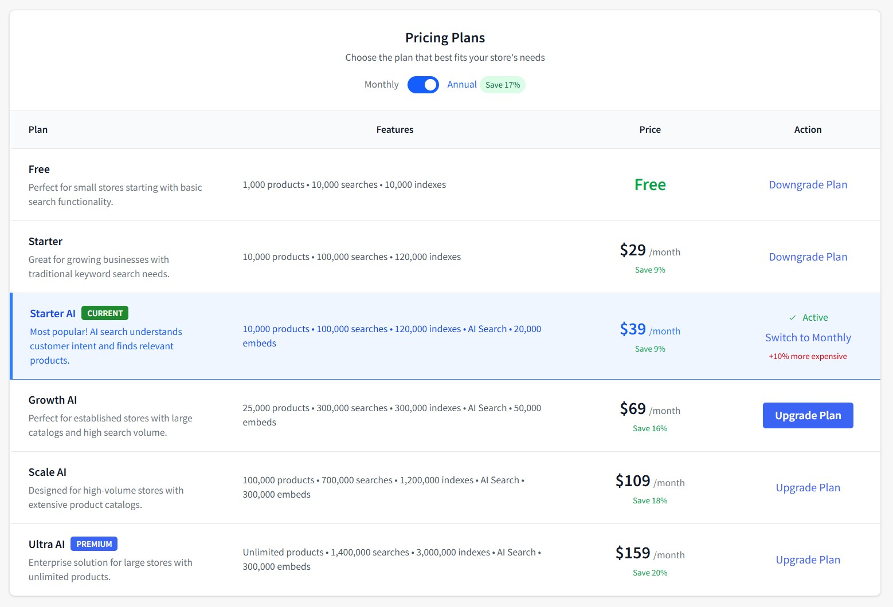

# Chapter 10: Plans & Pricing

Manage your subscription, billing, and add-ons to optimize costs and ensure uninterrupted service.

---

## Overview

The Pricing & Billing page helps you manage your subscription plan, monitor add-on usage, top up your wallet, and switch between different plans as your store grows.

**Main Functions:**

- View current subscription status and billing information
- Monitor add-on usage and costs
- Top up wallet balance for additional services
- Compare and switch between pricing plans
- Manage add-on limits and spending caps

---

## Interface Elements

### Header Section

**Navigation:**

- **← Back to Dashboard** - Return to main dashboard
- **💳 Top-up Wallet** - Add funds to your account ($ amount input)
- **Pay with PayPal** - Complete wallet top-up

### Current Subscription Card

**Subscription Information:**

- **Current Plan**: Plan name with status badge (e.g., "Starter AI" with "TRIAL" and "ACTIVE" badges)
- **Annual Fee**: Yearly subscription cost (e.g., "$39/year")
- **Next Billing**: Next payment date (e.g., "Jun 13, 2026")
- **Wallet Balance**: Available prepaid funds (e.g., "$280.00")

---

## Add-ons Usage & Costs

### Current Add-ons Overview

**Three Main Add-ons:**

**Embed Add-on** ($10/month):

- **Usage**: 0% (0 Used / 33,333 Total / 33,333 Remaining)
- **Current Cost**: $0.00
- **Rate**: $0.00030 per embed
- **Status**: ACTIVE

**Index Add-on** ($10/month):

- **Usage**: 0% (0 Used / 111,111 Total / 111,111 Remaining)
- **Current Cost**: $0.00
- **Rate**: $0.00009 per index
- **Status**: ACTIVE

**Search Add-on** ($10/month):

- **Usage**: 0% (0 Used / 249,999 Total / 249,999 Remaining)
- **Current Cost**: $0.00
- **Rate**: $0.00004 per search
- **Status**: ACTIVE

### Total Add-ons Cost

- **Current billing period**: $0.00
- **Note**: Costs will be added to your next invoice

**Purpose:**

- Monitor usage of additional services beyond your base plan
- Track spending on variable usage features
- Set limits to control costs

---

## Pricing Plans

### Billing Toggle

- **Monthly/Annual Toggle**: Switch between billing frequencies
- **Annual Savings**: "Save 17%" indicator for yearly billing

### Available Plans

**Free Plan**:

- **Features**: 1,000 products • 10,000 searches • 10,000 indexes
- **Description**: Perfect for small stores starting with basic search functionality
- **Price**: Free
- **Action**: Downgrade Plan

**Starter Plan**:

- **Features**: 10,000 products • 100,000 searches • 120,000 indexes
- **Description**: Great for growing businesses with traditional keyword search needs
- **Price**: $29/month (Save 9% annually)
- **Action**: Downgrade Plan

**Starter AI Plan** (CURRENT):

- **Features**: 10,000 products • 100,000 searches • 120,000 indexes • AI Search • 20,000 embeds
- **Description**: Most popular! AI search understands customer intent and finds relevant products
- **Price**: $39/month (Save 9% annually)
- **Status**: ✓ Active / Switch to Monthly (+10% more expensive)

**Growth AI Plan**:

- **Features**: 25,000 products • 300,000 searches • 300,000 indexes • AI Search • 50,000 embeds
- **Description**: Perfect for established stores with large catalogs and high search volume
- **Price**: $69/month (Save 16% annually)
- **Action**: Upgrade Plan

**Scale AI Plan**:

- **Features**: 100,000 products • 700,000 searches • 1,200,000 indexes • AI Search • 300,000 embeds
- **Description**: Designed for high-volume stores with extensive product catalogs
- **Price**: $109/month (Save 18% annually)
- **Action**: Upgrade Plan

**Ultra AI Plan** (PREMIUM):

- **Features**: Unlimited products • 1,400,000 searches • 3,000,000 indexes • AI Search • 300,000 embeds
- **Description**: Enterprise solution for large stores with unlimited products
- **Price**: $159/month (Save 20% annually)
- **Action**: Upgrade Plan

---

## Add-ons Management

### Add-ons Configuration Table

**Columns:**

- **Add-on**: Service name and description
- **Pricing**: Cost per unit and minimum purchase
- **Usage & Quota**: Current usage vs available quota
- **Current Cost**: Charges for current billing period
- **Monthly Limit**: Spending cap setting
- **Status**: Enable/disable toggle

### Available Add-ons

**Search Add-on**:

- **Pricing**: \$0.00004 per search, Min: 10K ($0.4)
- **Usage**: 0 / 250K / 250K (Used/Total/Remaining)
- **Current Cost**: $0.00 this period
- **Monthly Limit**: $10/month
- **Status**: 🔵 ENABLED
- **Description**: Purchase in multiples of 10,000 events

**Index Add-on**:

- **Pricing**: \$0.00009 per index, Min: 10K ($0.9)
- **Usage**: 0 / 111K / 111K (Used/Total/Remaining)
- **Current Cost**: $0.00 this period
- **Monthly Limit**: $10/month
- **Status**: 🔵 ENABLED
- **Description**: Purchase in multiples of 10,000 events

**Embed Add-on**:

- **Pricing**: \$0.00030 per embed, Min: 5K ($1.5)
- **Usage**: 0 / 33K / 33K (Used/Total/Remaining)
- **Current Cost**: $0.00 this period
- **Monthly Limit**: $10/month
- **Status**: 🔵 ENABLED
- **Description**: Purchase in multiples of 5,000 events

### Total Add-ons Cost

- **Summary**: $0.00 per period
- **Note**: Current billing period usage • Costs will be added to your next invoice

---

## Wallet Management

### Top-up Process
1. Enter amount in the **$ amount** field (minimum $5, increments of $5)
2. Click **Pay with PayPal** button
3. Complete payment through PayPal
4. Funds are immediately added to your wallet

### Wallet Balance
- **Current Balance**: Displayed in Current Subscription section
- **Usage**: Wallet funds are used for all charges and add-on costs
- **Manual Top-up Required**: You must manually top up wallet from PayPal when balance is low

!!! tip "💰 Wallet Top-up"
    Keep sufficient wallet balance to cover your monthly add-on usage. You need to manually top up your wallet from PayPal when the balance gets low. The system will not automatically charge PayPal.

---

## Plan Operations

### Upgrading Plans
1. Find the desired plan in the Pricing Plans section
2. Click **Upgrade Plan** button
3. Confirm the upgrade
4. Changes take effect immediately
5. Prorated charges will be applied

### Downgrading Plans
1. Select a lower-tier plan
2. Click **Downgrade Plan** button
3. Confirm the downgrade
4. Changes take effect on next billing cycle
5. No immediate charges

### Switching Billing Frequency
1. Toggle between **Monthly** and **Annual** at the top
2. See savings percentage for annual plans
3. For current plan, click **Switch to Monthly/Annual**
4. Billing frequency changes on next cycle

!!! warning "⚠️ Plan Changes"
    **Upgrades**: Take effect immediately with prorated charges
    **Downgrades**: Take effect on your next billing cycle

---

## Add-on Management

### Enabling Add-ons
1. Find the add-on in the Add-ons table
2. Toggle the **Status** switch to enable
3. Set a **Monthly Limit** to control spending
4. Monitor usage throughout the billing period

### Setting Monthly Limits
- **Purpose**: Control maximum spending on variable usage
- **Recommendation**: Set based on expected usage patterns
- **Overage Protection**: Service stops when limit is reached
- **Adjustment**: Can be changed anytime during billing period

### Usage Monitoring
- **Real-time Tracking**: Usage updates in real-time
- **Quota Display**: Shows used/total/remaining for each add-on
- **Cost Tracking**: Current period charges displayed
- **Monthly Reset**: Usage resets each billing cycle

---

## Billing Information

### Payment Process
1. **Wallet Balance**: All charges deducted from wallet balance
2. **Manual Top-up**: You must top up wallet from PayPal when balance is low
3. **No Auto-charge**: System does not automatically charge PayPal when wallet is empty

### Next Billing
- **Date**: Shown in Current Subscription card
- **Amount**: Base plan fee plus any add-on overages
- **Payment Source**: Deducted from wallet balance only

### Cost Optimization Tips

**Plan Selection:**

- Start with basic plans and upgrade as needed
- Choose annual billing for 17% savings
- Monitor usage to select appropriate tier

**Add-on Management:**

- Set realistic monthly limits based on usage history
- Enable only needed add-ons
- Monitor usage weekly to avoid surprise charges

**Wallet Strategy:**

- Maintain sufficient balance for monthly add-on costs
- Top up before balance gets too low
- Use suggested amounts for planning

---

## Troubleshooting

### Common Issues

**Plan Upgrade Not Showing**

- **Problem**: Upgraded plan not reflected immediately
- **Solution**: Upgrades are immediate, check Current Subscription card
- **Check**: Verify wallet balance was sufficient for upgrade

**Add-on Limit Reached**

- **Problem**: Service stopped due to monthly limit
- **Solution**: Increase monthly limit in Add-ons table
- **Prevention**: Monitor usage regularly and set appropriate limits

**Wallet Top-up Failed**

- **Problem**: PayPal payment failed or amount rejected
- **Solution**: Check amount is $5+ in $5 increments, verify PayPal account
- **Contact**: Support if payment issues persist

### Payment Issues

**Insufficient Wallet Balance**

- Manually top up wallet using PayPal before services are suspended
- Ensure sufficient funds for plan + estimated add-on costs
- System will not automatically charge PayPal when wallet is empty

**Invalid Top-up Amount**

- Minimum $5, maximum $1,000
- Must be in \$5 increments ($5, $10, $15, etc.)
- No decimal amounts allowed

---

**Next Chapter**: [Billing Information](./11-billing-information.md) - View detailed billing history and manage payment methods.