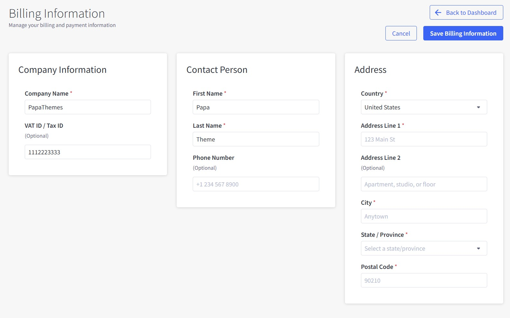

# Chapter 11: Billing Information

Update your billing details for accurate invoicing, tax compliance, and account verification.

---

## How to Access Billing Information

1. Click **📄 Billing Info** from Dashboard
2. Complete the three sections: Company Information, Contact Person, and Address

---

## Company Information

**Company Name** (Required)

- Use your official business name
- Appears on all invoices

**VAT ID / Tax ID** (Optional)

- **EU businesses**: Format like "GB123456789"
- **US businesses**: Enter your EIN number
- Required for tax-exempt transactions

---

## Contact Person

**Required Fields:**

- **First Name** and **Last Name**: Primary billing contact
- **Phone Number** (Optional): Business contact with country code

---

## Address Information

**Required Fields:**

- **Country**: Determines tax calculations
- **Address Line 1**: Primary street address
- **City**: Official city name
- **State/Province**: Select from dropdown
- **Postal Code**: ZIP code or postal code

**Optional:**

- **Address Line 2**: Suite, apartment, or additional details

---

## Saving Changes

1. Complete all required fields (marked with *)
2. Click **Save Billing Information**
3. Use **Cancel** to discard changes

---

## Important Notes

### Tax Compliance
- **VAT ID enables**: Reverse charge for EU B2B transactions
- **Address determines**: Tax jurisdiction and rates
- **Use business address**: Not personal address

### When to Update
- Business name or address changes
- New tax ID obtained
- Before plan upgrades
- Annual review recommended

### Common Issues
- **Form won't save**: Check required fields marked with *
- **Invalid VAT ID**: Verify format with tax authorities
- **Address errors**: Use official postal address format

---

## Legal & Compliance

### Tax and Legal Requirements

Your billing information is used to comply with various tax and business laws. Company names and addresses are legally required on business invoices in most jurisdictions. For EU businesses, providing a valid VAT ID enables the reverse charge mechanism, which can exempt you from paying VAT on B2B transactions. Your billing address determines which tax laws apply to your transactions and helps calculate the correct tax rates.

We retain your billing information for tax audit and compliance purposes, typically for seven years as required by most tax authorities. This helps both you and us maintain proper records for potential tax audits or regulatory inquiries.

### Your Data Protection Rights

Under data protection laws like GDPR (for EU customers) and CCPA (for California residents), you have specific rights regarding your personal information. This includes the right to access, correct, or delete your personal data. We use your billing information solely for billing, invoicing, and tax compliance purposes - never for marketing or other unrelated activities.

Your billing data is never shared with third parties for marketing purposes. We may verify your information against business registration databases to authenticate your account and prevent fraud, but this is done solely for security and compliance reasons.

### Your Responsibilities

You are responsible for providing accurate and current billing information. If your business details change, you should update this information promptly to ensure continued compliance with tax laws and proper invoice generation.

For specific questions about VAT ID requirements or tax compliance, we recommend consulting with your tax advisor, as tax laws vary by jurisdiction and can be complex. While we provide the tools to collect and store your billing information securely, compliance with local tax and business laws remains your responsibility.

---

## Data Security

- All information encrypted and secure
- Used only for billing and tax purposes
- Access restricted to authorized personnel only
- Regular security audits and compliance monitoring

---