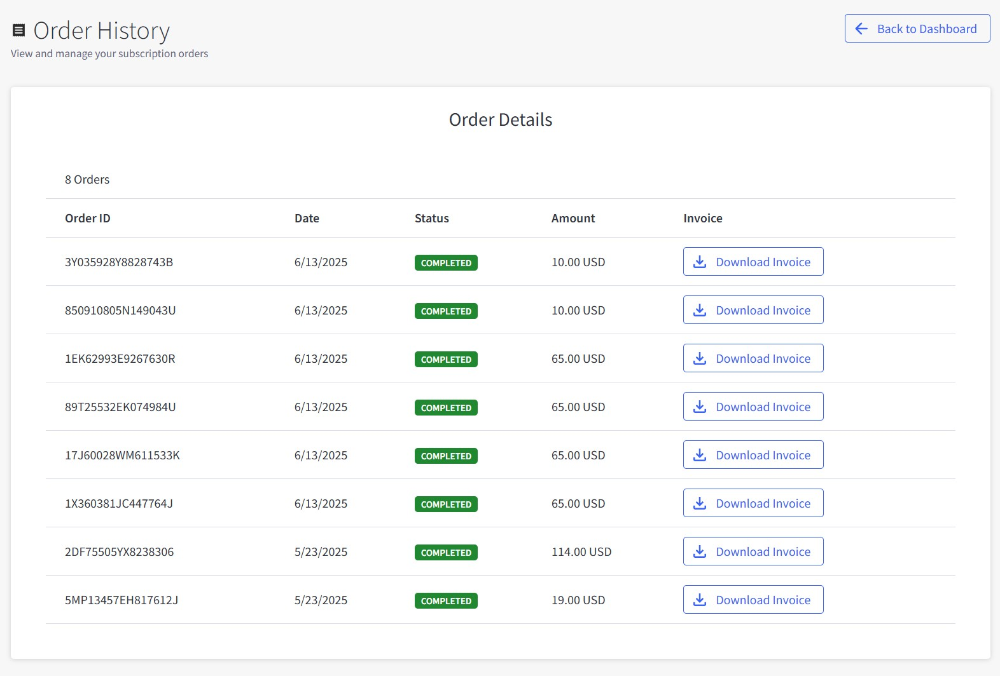

# Chapter 12: Order History

View your PayPal wallet top-up transactions and download payment receipts.

---

## How to Access Order History

1. Click **📋 Orders** from Dashboard
2. View your PayPal wallet top-up transactions in the Order Details table

---

## Understanding Order Details

### Order Information Display

**Order Table Columns:**

- **Order ID**: Unique PayPal transaction identifier (e.g., "3Y035928Y8828743B")
- **Date**: When you topped up your wallet (e.g., "6/13/2025")
- **Status**: PayPal payment status with colored badges
- **Amount**: Amount you added to wallet in USD
- **Invoice**: Download button for PayPal payment receipts

### Status Types

**COMPLETED** (Green Badge)

- PayPal payment successfully processed
- Funds added to your wallet
- Receipt available for download

---

## How to Download Payment Receipts

1. **Locate your wallet top-up** in the Order Details table
2. **Click Download Invoice** button (📥 icon)
3. **PDF receipt downloads** automatically to your device
4. **Save the file** for your records

**All completed PayPal payments show "Download Invoice" button for receipts.**

---

## Wallet Top-up Amounts

### Common Top-up Amounts

**PayPal Wallet Top-ups:**

- **$10.00 USD**: Small wallet top-up
- **$65.00 USD**: Medium wallet top-up
- **$114.00 USD**: Large wallet top-up
- **$19.00 USD**: Custom wallet top-up

### Payment Source

- **PayPal Only**: All transactions are PayPal payments to add funds to your wallet
- **Note**: Order History only shows PayPal top-up transactions, not service charges or subscription fees

---

## Managing Your Wallet Top-up History

### Reviewing Transactions

- **Check regularly**: Monitor your wallet top-up payments
- **Verify amounts**: Ensure PayPal charges match your top-ups
- **Download receipts**: Keep records for accounting
- **Report issues**: Contact support for discrepancies

### Record Keeping

- **Business expenses**: Download receipts for tax purposes
- **Payment tracking**: Monitor wallet funding transactions
- **PayPal verification**: Confirm successful wallet top-ups

---

## When to Check Order History

### Regular Reviews

- **After wallet top-ups**: Verify PayPal payments processed successfully
- **Before low balance**: Check when you last added funds
- **Before tax season**: Gather wallet funding records
- **Payment issues**: Check PayPal transaction status

### Before Contacting Support

- **Find Order ID**: Locate specific PayPal transaction reference
- **Check payment status**: Verify if wallet top-up completed
- **Download receipts**: Gather PayPal payment documentation

---

## Troubleshooting Common Issues

### If Download Invoice Fails

1. **Check browser settings**: Allow pop-ups and downloads
2. **Try different browser**: Use Chrome, Firefox, or Safari
3. **Clear browser cache**: Remove temporary files
4. **Contact support**: Provide Order ID if issues persist

### If Order Missing

- **Check date range**: Orders may be from different time period
- **Verify account**: Ensure you're logged into correct account
- **Wait for processing**: Recent payments may take a few minutes to appear

### If Amount Incorrect

- **Review PayPal receipt**: Check the amount you actually paid through PayPal
- **Consider PayPal fees**: Amounts may include PayPal processing fees
- **Check wallet balance**: Verify funds were added to your wallet
- **Contact support**: Provide Order ID for investigation

---

## Data and Privacy

### Payment Record Retention

- **Permanent storage**: PayPal top-up history kept indefinitely
- **Legal compliance**: Payment records maintained for tax and audit purposes
- **Receipt access**: Download PayPal payment receipts anytime

### Security

- **Encrypted data**: All PayPal payment information secured
- **Access control**: Only account owners can view wallet top-up history
- **Secure downloads**: Receipt PDFs protected during transfer

---